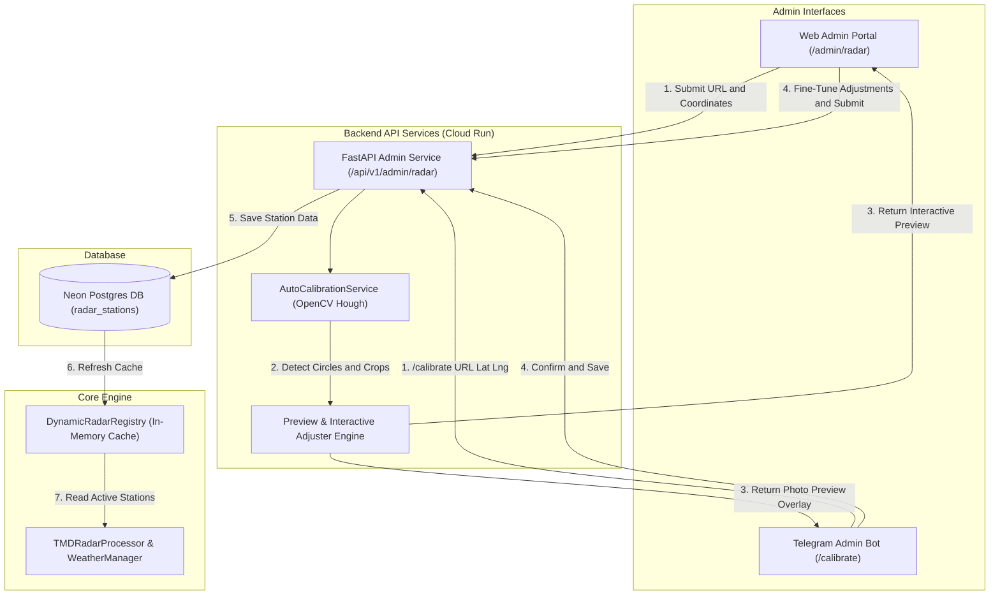

# OPERATIONS.md — FonMaYang Runbook

Admin and on-call operational reference for the FonMaYang system.

---

## Table of Contents

1. [Emergency Overdrive Mode](#1-emergency-overdrive-mode)
2. [Circuit Breaker](#2-circuit-breaker)
3. [Token Recovery — Last Resort CS](#3-token-recovery--last-resort-cs)
4. [Checking & Querying Donor Records](#4-checking--querying-donor-records)
5. [System Status & Monitoring](#5-system-status--monitoring)
6. [Cloud Run & IAM](#6-cloud-run--iam)
7. [Scheduler Jobs](#7-scheduler-jobs)
8. [Future Identity & KYC Strategy](#8-future-identity--kyc-strategy)
9. [Dynamic Radar Station Management (Neon DB + Admin Web Portal)](#9-dynamic-radar-station-management-neon-db--admin-web-portal)

---

## 1. Emergency Overdrive Mode

Overrides the Circuit Breaker and forces the system into `INVINCIBLE` (∞) status, bypassing normal runway countdown.

### Toggle via Telegram Bot (Admin only)

```
/overdrive on      → Enable Emergency Overdrive (writes to NeonDB)
/overdrive off     → Disable, return to normal runway countdown
/overdrive status  → Read current value from DB
```

### What it does

- Writes `emergency_overdrive = "true"` to `system_config` table in NeonDB
- Circuit Breaker is bypassed even if budget is zero
- Dashboard shows **Extended Lifespan Mode / โหมดต่ออายุระบบฉุกเฉิน** badge
- Audit log is written on every toggle

---

## 2. Circuit Breaker

Auto-activates when the GCP budget jar reaches zero. Blocks external API calls and switches to cached/fallback data.

### States

| State | `circuit_breaker_active` in DB | Meaning |
|---|---|---|
| Normal | `false` | All APIs operational |
| Tripped | `true` | Cached weather data only |

- **Resets automatically** when budget is replenished and `/overdrive on` is toggled then off.
- **Check via Telegram:** `/status` shows both `emergency_overdrive` and `circuit_breaker_active`.

---

## 3. Token Recovery — Last Resort CS

For donors who have lost **both** their `Fon-XXXX-XXXX` token **and** all transaction details.

### Step-by-step

**Step 1 — Advise donor to check Stripe Receipt Email**

Stripe sends a payment receipt to the donor's email automatically at the time of payment. The receipt contains the Payment Intent ID (`pi_...`), which can be used in the **Token Recovery Modal** on the dashboard.

**Step 2 — If donor still cannot find details**

Ask the donor to send the following via Telegram to the admin:
- Screenshot of bank transfer slip or Stripe receipt
- Approximate amount (THB)
- Approximate date of donation

**Step 3 — Admin lookup via Admin Backoffice Console**

เปิดหน้า **Admin Backoffice Console** บน Dashboard (ต้อง login ด้วย Admin account):

1. ไปที่ส่วน **CS Token Recovery Search**
2. กรอก Approximate Amount (THB) และ Approximate Date
3. แนบ Screenshot slip/receipt เป็นหลักฐาน (optional, ไม่ถูกเก็บใน DB)
4. ระบบค้นหา Donor record ที่ตรงกัน (tolerance ±50 THB, ±1 วัน)
5. กด **Reveal Token** เพื่อดู Token เต็ม (มี Confirmation dialog + Audit log)

**Step 4 — Deliver Token to Donor**

- Send `Fon-XXXX-XXXX` token to the donor via Telegram DM or the channel they used to contact admin.
- **Do not** send via email or log the exchange with PII.
- Record the manual recovery in a note on the relevant GitLab issue if part of a support request.

> ⚠️ **Fraud Prevention:** Before delivering the token, verify that the slip/screenshot amount and date matches the DB record. Never deliver a token based on verbal claim alone.

### Fraudulent Revoke Protection & Disputes

In cases where a malicious actor gains access to a donor's Stripe receipt/Transaction ID and attempts to fraudulently revoke/claim a token:

1. **Self-Service Revoke Limits**: Self-service token re-issuance is rate-limited (max 2 times per 30 days) and restricted to a 72-hour window post-payment.
2. **Revoke Notification Email**: Any re-issuance triggers an automated alert to the original Stripe receipt email address.
3. **Admin Dispute Resolution (Fraud Claim)**:
   - Admin freezes the disputed token via Admin Backoffice Console (`/api/v1/admin/donors/freeze-token`).
   - Admin requests deep proof from the victim: **Bank Statement / Credit Card Statement** showing the last 4 digits of the card used for the Stripe payment.
   - Upon verification against Stripe API Charge Query, Admin revokes the attacker's token, re-issues to the legitimate owner, and blacklists the attacker's IP/Device.

---

## 4. Checking & Querying Donor Records

### Direct DB query (local dev with `.env` pointing to Neon dev branch)

```bash
cd backend
source .venv/bin/activate
python3 - <<'EOF'
import asyncio
from sqlalchemy.future import select
from app.database import AsyncSessionLocal
from app.models import Donor

async def main():
    async with AsyncSessionLocal() as db:
        result = await db.execute(select(Donor).order_by(Donor.timestamp.desc()).limit(10))
        for d in result.scalars().all():
            print(d.token, d.amount, d.timestamp, d.pseudonym)

asyncio.run(main())
EOF
```

### NeonDB Branches

| Branch | Used by | DATABASE_URL env var |
|---|---|---|
| `main` | Production (Cloud Run) | `DATABASE_URL_PROD` |
| `staging` | Staging (Cloud Run) | `DATABASE_URL_STAGING` |
| `dev` | Local development | `DATABASE_URL` (in `.env`) |

---

## 5. System Status & Monitoring

```
/status    → Telegram Admin Bot — system status, GCP costs, overdrive, circuit breaker
/metrics [days]  → Export Cron job performance history as CSV (ไม่ใช่ข้อมูล Donor)
```

> ℹ️ `/metrics` ส่ง CSV ของ **Cron job performance** เท่านั้น ประกอบด้วย: routine_name, run_at, duration_s, alerts_sent, locations_checked, errors — **ไม่มีข้อมูล Donor / Token**

### Key API Endpoints

| Endpoint | Description |
|---|---|
| `GET /health` | Basic health check |
| `GET /api/v1/runway` | Current runway status, budget, overdrive flag |
| `GET /api/v1/metrics/gcp-costs` | GCP infrastructure cost breakdown |
| `GET /api/milestones` | Donation milestone progress |

### Environment Isolation Note

- `dev`, `staging`, and `production` should each use separate GCP projects, BigQuery billing datasets, Neon DB targets, backend/worker URLs, and secrets.
- `staging` should mirror production behavior, but never point at production workers or production DBs.
- If an on-call check shows cross-env leakage, treat it as a config bug first, not a billing or Neon data bug.

### Cloud Strategy Note

- For FonMaYang, **GCP is the primary long-term platform** because the current stack fits serverless + IAP-style access patterns with less ops burden.
- Treat **AWS as an optional secondary path** for learning, sandboxing, or future enterprise comparison work rather than the default production target.
- If a future change proposes moving production to AWS, review the full migration cost, ops burden, and service parity first.

---

## 6. Cloud Run & IAM

```bash
# Restore public access (after accidental lockout)
/restore_public_access   (Telegram Admin Bot)

# Or directly via script
bash backend/scripts/restore_public_access.sh

# Disable public access (private mode)
/disable_public_access   (Telegram Admin Bot)

# Audit IAM
bash backend/scripts/check_public_access.sh
```

---

## 7. Scheduler Jobs

```
/job pause <job_name>    → Pause a Cloud Scheduler job
/job resume <job_name>   → Resume a Cloud Scheduler job
```

Manual sync/setup:

```bash
python3 backend/scripts/sync_schedulers.py
bash backend/scripts/setup_schedulers.sh
```


---

## 9. Dynamic Radar Station Management (Neon DB + Admin Web Portal)

Operational guide for managing TMD radar stations dynamically without codebase redeployment.

### Architecture Overview



```
Admin Interface (Telegram / Web Portal) ──► Admin API (/api/v1/admin/radar) ──► AutoCalibrationService
                                                                                      │
                                                                                      ▼
TMDRadarProcessor ◄── DynamicRadarRegistry (In-Memory Cache) ◄── RadarStationRepository (Neon DB)
```

### 1. Telegram Admin Bot (`/calibrate`)

Admins can trigger auto-calibration and preview boundary overlays directly in Telegram:

```
/calibrate <code|url> <lat> <lng> [radius_km]

# Example:
/calibrate svp240 https://weather.tmd.go.th/svp/svp240_latest.jpg 13.6860 100.7486 240
```

- **Output**: Returns a photo preview overlay with green radar scope boundary & red center crosshair, plus auto-detected crop dimensions.

### 2. Web Admin Portal (`/admin/radar`)

Access the Next.js Admin Portal at `http://localhost:3000/admin/radar` (or production host) to:
- Fill station metadata (Code, Name, Image URL, Lat, Lng, Radius).
- Interactively fine-tune Crop X/Y/Width/Height sliders in real time.
- View live preview canvas before saving.
- Click **Submit to Neon DB** to persist config to `radar_stations` PostgreSQL table.
- Toggle active/disabled states for maintenance without downtime.


### 🏗️ สถาปัตยกรรม Dynamic Radar Management (Telegram Bot + Web Admin Portal)

```mermaid
flowchart TD
    subgraph Admin Interfaces
        A1[🌐 Web Admin Portal - React / Next.js]
        A2[📱 Telegram Admin Bot Command /calibrate]
    end

    subgraph Backend API Services (Cloud Run)
        API[FastAPI Admin Service]
        AutoCal[AutoCalibrationService OpenCV Hough]
        PreviewEngine[Preview & Interactive Adjuster Engine]
    end

    subgraph Database
        Neon[(🐘 Neon Postgres DB: radar_stations)]
    end

    A1 -->|1. Submit URL/Coords| API
    A2 -->|1. /calibrate URL Lat Lng| API
    API --> AutoCal
    AutoCal -->|2. Detect Circles & Crops| PreviewEngine
    PreviewEngine -->|3. Return Interactive Preview & BBox Coordinates| A1
    PreviewEngine -->|3. Return Image Preview & Adjusted BBox| A2
    A1 -->|4. Fine-Tune Adjustments & Submit| API
    A2 -->|4. Confirm & Save| API
    API -->|5. UPSERT Station Data| Neon
```
