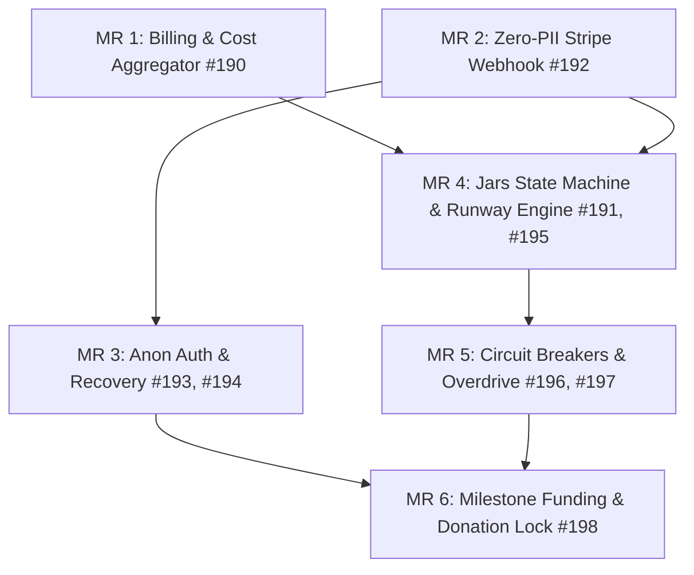

# ADR 010: Gamified Finance & Infrastructure Management Platform MR Batching Strategy

## Status
Proposed

## Context
We are implementing a new Gamified Financial Transparency System comprising 9 issues (#190 - #198). To ensure high-quality code reviews, prevent Large Merge Requests (MRs), and control system complexity, we must group these tasks logically. Large MRs increase deployment risk and review latency, while separate MRs for tightly-coupled components create integration overhead.

## Decision
We will partition the 9 issues into **6 distinct, sequential Merge Requests (MRs)** based on dependency order, security isolation, and feature cohesion:

---

### MR 1: Billing Data Foundation
- **Issues**: 
  - [DevOps] GCP/AWS Billing API Integration & Cost Aggregator ([#190](https://gitlab.com/oatricedev/FonMaYang/-/work_items/190))
- **Scope**: 
  - Implement read-only clients for GCP Cloud Billing & AWS Cost Explorer.
  - Aggregation pipeline for baseline and variable costs stored in Firestore/Redis.
- **Rationale**: Isolates IAM configuration and external API integration tasks, establishing the cost database schema.

### MR 2: Stripe Payment Webhook
- **Issues**: 
  - [Security] Zero-PII Stripe Webhook Listener & Transaction Logger ([#192](https://gitlab.com/oatricedev/FonMaYang/-/work_items/192))
- **Scope**: 
  - Stripe webhook listener endpoint with signature verification.
  - Database logging storing only `Stripe_Customer_ID` and `Transaction_ID`.
- **Rationale**: Isolates payment processing and security validation to guarantee zero PII data persistence.

### MR 3: Anonymous Auth & Recovery Flow
- **Issues**: 
  - [Feature] Pseudonymous Authentication & Magic Link Token Generator ([#193](https://gitlab.com/oatricedev/FonMaYang/-/work_items/193))
  - [Security] Two-Factor Financial Account Recovery Flow ([#194](https://gitlab.com/oatricedev/FonMaYang/-/work_items/194))
- **Scope**: 
  - Token generator (`Fon-XXXX-XXXX`) and Local Storage auth persistence.
  - Hashing mechanism (Bcrypt/SHA-256 + Salt) for Transaction IDs.
  - 3-point recovery API (`Hashed_Transaction_ID` + `Timestamp` + `Exact Amount`).
- **Rationale**: Groups the complete anonymous identity and credentials lifecycle. Hashing verification code is kept near the authentication context.

### MR 4: Budget Jars & Runway Engine
- **Issues**: 
  - [Architecture] Dynamic Runway Countdown Engine ([#191](https://gitlab.com/oatricedev/FonMaYang/-/work_items/191))
  - [Backend] Budget Jars State Machine & Allocation Strategy ([#195](https://gitlab.com/oatricedev/FonMaYang/-/work_items/195))
- **Scope**: 
  - Multi-jar allocation splits and time-decay routine for Dev Salary.
  - Mathematical implementation of runway countdown.
  - Server-Sent Events (SSE) or WebSockets broadcast endpoint.
- **Rationale**: Pairs the runway engine with the budget source (Jars) that drives it. Directly consumes the cost metrics from MR 1.

### MR 5: Resiliency & Feature Controls
- **Issues**: 
  - [Architecture] Dynamic Feature Flag & Circuit Breaker System ([#196](https://gitlab.com/oatricedev/FonMaYang/-/work_items/196))
  - [Feature] Emergency Overdrive Mode (Free Period Bypass) ([#197](https://gitlab.com/oatricedev/FonMaYang/-/work_items/197))
- **Scope**: 
  - Middleware/Interceptors for API fallbacks when `Jar.HP <= 0`.
  - Override switch to force "Invincible Mode" (bypass circuit breakers, freeze runway).
- **Rationale**: Concentrates runtime middleware overrides and fallbacks together, ensuring both failure modes and admin bypasses can be tested concurrently.

### MR 6: Milestone Presentation & Security Lock
- **Issues**: 
  - [Feature] Anonymized Milestone Funding & Donation Lock Mechanism ([#198](https://gitlab.com/oatricedev/FonMaYang/-/work_items/198))
- **Scope**: 
  - Read-only progress bar data endpoints.
  - Kill-switch to anonymize leaderboards instantly.
  - Redirect logic to "Future Donor Waiting List".
- **Rationale**: Focuses on public gamification elements and their security panic buttons. Depends on the Auth (MR 3) and Jars (MR 4) models.

---

## Consequences
- **Reviewability**: Each MR targets less than 300-500 lines of code changes (except for schema definitions), facilitating fast PR cycle times.
- **Verification**: Developers can write targeted mock tests for each MR context.
- **Dependency Flow**: Subsequent MRs can be built on top of the schemas and endpoints defined in earlier MRs.
