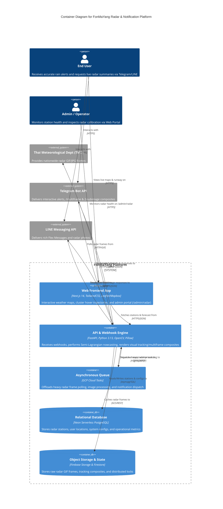
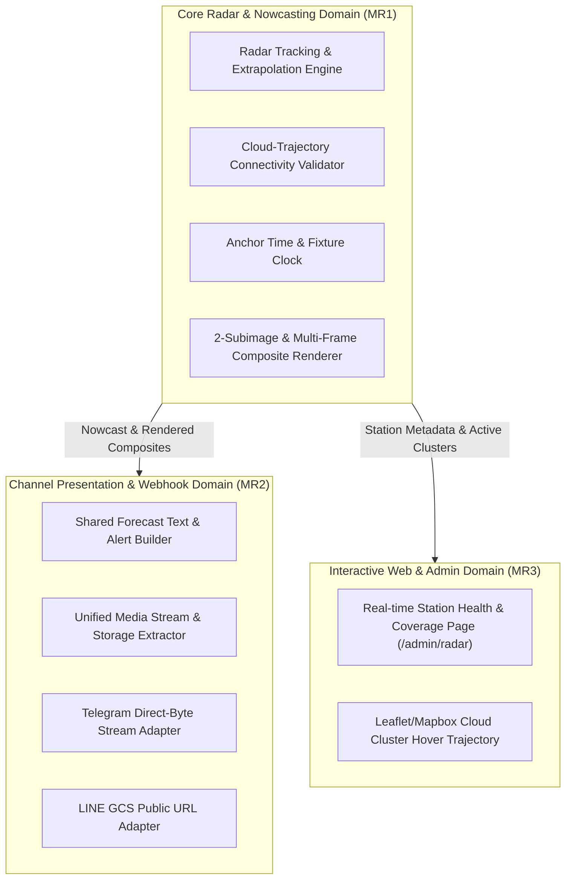

# Architecture & Multi-Issue MR Roadmap: Radar Trajectory, Webhook Architecture & Interactive Maps

## 1. Executive Summary & Jobs To Be Done (JTBD)
- **User Job:** "When I check the weather or get alerted via Telegram/LINE, I want accurate rain trajectory predictions without false alerts or floating lines, so I can plan my travel with complete confidence."
- **Admin/Operator Job:** "When I monitor radar status across Thailand, I want a real-time visual map and unified webhook architecture, so I can diagnose station outages and maintain reliable multi-channel messaging easily."
- **Engineering Job:** "When validating radar algorithms, I want deterministic, hermetic test fixtures and modular code under 500 LOC per MR, so that CI pipelines are lightning fast, flake-free, and safe to deploy."

---

## 2. C4 Container Architecture Diagram

---

## 3. Domain-Driven Design (DDD) & Bounded Contexts

---

## 4. Multi-Issue MR Roadmap (< 500 LOC per MR)

### 🚀 MR 1: Radar Trajectory Precision & Bot Multi-Frame Presentation
- **Issues Resolved:** `#268`, `#263`, `#183`
- **Estimated Scope:** ~320 LOC
- **Bounded Context:** Core Radar Nowcasting & Telegram Command Router
- **Key Deliverables:**
  1. **Suppress False Trajectory & Alert (#268):** Validate that predicted cloud points intersect with an actively detected cloud cluster before rendering blue trajectory lines or emitting rain status text.
  2. **2-Subimage Composite & `/multiframe` (#263):** Replace 4-panel tracking image with clean 2-subimage layout (`Raw image with grid` vs `Final prediction overlay`) and add standalone `/multiframe` command.
  3. **Deterministic Fixture Tests (#183):** Decouple `datetime.now()` wall-clock from `extrapolate_rain_at_pixel` and `weather_manager.py` using explicit anchor timestamps.

---

### 📦 MR 2: Unified Telegram & LINE Webhook Architecture & Wind Ghosting
- **Issues Resolved:** `#185`, `#70`
- **Estimated Scope:** ~380 LOC
- **Bounded Context:** Channel Presentation & Media Adaptation
- **Key Deliverables:**
  1. **Shared Message & Media Processor (#185):** Centralize forecast text generation and media extraction in `webhook_utils.py` for both Telegram and LINE.
  2. **Historical Wind Vector Ghosting (#70):** Overlay fading historical wind vector arrows and OpenCV timestamp burning onto cropped radar frames.

---

### 🗺️ MR 3: Web App Radar Hover Trajectory & Admin Status Portal
- **Issues Resolved:** `#270`, `#188`
- **Estimated Scope:** ~420 LOC
- **Bounded Context:** Web Application Frontend & Admin Monitoring
- **Key Deliverables:**
  1. **Admin Station Status Page (#270):** Interactive map on `/admin/radar` showing online/delayed/offline station status across Thailand.
  2. **Cloud Cluster Hover Preview (#188):** Interactive hover state on web maps displaying past trajectory motion vectors of individual clouds.
