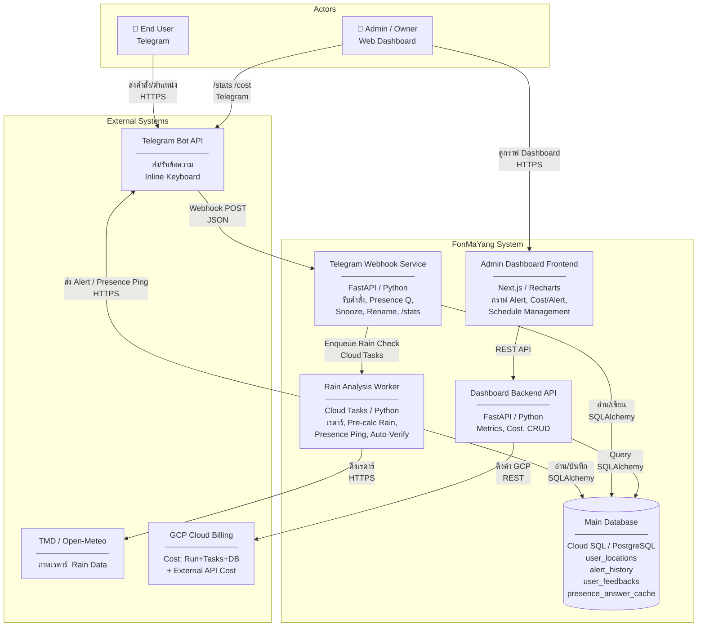

# FonMaYang – C4 Container Diagram & Architecture

## C4 Container Diagram

```
┌───────────────────────────────────────────────────────────────────────────┐
│                          FonMaYang System                                 │
│                                                                           │
│  ┌──────────────────────┐       ┌──────────────────────────────────────┐  │
│  │  Telegram Webhook    │       │   Rain Analysis & Verification       │  │
│  │  Service             │──────▶│   Worker                             │  │
│  │                      │       │                                      │  │
│  │  FastAPI / Python    │       │  Cloud Tasks / Python                │  │
│  │  - รับคำสั่ง Bot     │       │  - วิเคราะห์เรดาร์ & ฝน             │  │
│  │  - Presence Check Q  │       │  - Presence Verification (pre-calc)  │  │
│  │  - Snooze / Mute     │       │  - Auto False-Alarm Verify (+30m)    │  │
│  │  - Rename Location   │       │  - จัดคิว Alert / Ping              │  │
│  │  - /stats, /cost     │       │                                      │  │
│  └──────────┬───────────┘       └──────────────┬───────────────────────┘  │
│             │                                  │                          │
│             │                    ┌─────────────▼──────────────────────┐  │
│             │                    │  Dashboard Backend API             │  │
│             │                    │                                    │  │
│             │                    │  FastAPI / Python                  │  │
│             │                    │  - Metrics & Cost Aggregation      │  │
│             │                    │  - UserLocation CRUD               │  │
│             │                    │  - GCP Billing Proxy               │  │
│             │                    └─────────────┬──────────────────────┘  │
│             │                                  │                          │
│             │          ┌───────────────────────▼──────────────────────┐  │
│             │          │  Admin Dashboard Frontend                    │  │
│             └─────────▶│                                              │  │
│                        │  Next.js / TailwindCSS / Recharts            │  │
│                        │  - กราฟ Alerts vs False Alarms               │  │
│                        │  - Cost per Alert (GCP + External)           │  │
│                        │  - Location Schedule Management              │  │
│                        └──────────────────────────────────────────────┘  │
│                                                                           │
│                  ┌────────────────────────────────────────────────┐      │
│                  │  Main Database                                 │      │
│                  │  Cloud SQL / PostgreSQL                        │      │
│                  │                                                │      │
│                  │  Tables:                                       │      │
│                  │  - user_locations  (+ snooze, presence cols)  │      │
│                  │  - alert_history                               │      │
│                  │  - user_feedbacks                              │      │
│                  │  - external_cost_config                        │      │
│                  │  - presence_answer_cache  [NEW]                │      │
│                  └────────────────────────────────────────────────┘      │
└───────────────────────────────────────────────────────────────────────────┘

External Systems:
  ┌─────────────────────┐  ┌──────────────────────┐  ┌──────────────────────┐
  │  Telegram Bot API   │  │  TMD / Open-Meteo    │  │  GCP Cloud Billing   │
  │  - ส่ง/รับข้อความ   │  │  Radar API           │  │  API + External Cost │
  │  - Inline Keyboard  │  │  - ภาพเรดาร์         │  │  Config              │
  └─────────────────────┘  └──────────────────────┘  └──────────────────────┘
```

---

## Mermaid C4 Container Diagram (สำหรับ Mermaid v10+ renderer)



---

## Data Flow: Presence Check (คำถามที่ 1 – ฉบับสมบูรณ์)

> อธิบายกระบวนการ Pre-Calculation → Presence Question → Countdown → Full Alert

### ขั้นตอน Pre-Calculation (Worker เท่านั้น)

```
[Scheduler ทุก 5–10 นาที]
       │
       ▼
Worker: ดึง Radar Frame ล่าสุด
       │
       ▼
สำหรับแต่ละ UserLocation ที่ Active:
  1. คำนวณ Rain Intensity ที่ lat/lng  (mm/hr)
  2. คำนวณ ETA ของกลุ่มฝน  (นาที)
  3. บันทึก pre-calc result ไว้ใน DB หรือ Cache
       │
       ├─ intensity < threshold (เช่น < 5 mm/hr)  → ข้ามทั้งหมด
       │
       └─ intensity >= threshold
              │
              ▼
       ตรวจสอบ Presence Policy ของพิกัดนั้น
```

### ขั้นตอน Presence Check Decision Tree

```
UserLocation มี presence_policy = ?
       │
       ├── "always_notify"       → ส่ง Full Alert ทันที (ไม่ถาม)
       │
       ├── "always_ask"          → ส่ง Presence Ping ทุกครั้ง
       │
       ├── "schedule_based"      → ตรวจว่าตอนนี้อยู่ใน Active Time Window ไหม?
       │       ├── ใช่ → ส่ง Full Alert ทันที
       │       └── ไม่ใช่ → ส่ง Presence Ping
       │
       └── "silent_card"        → ส่ง Muted Alert (ไม่มีเสียง) พร้อมปุ่ม Snooze
```

### Presence Ping Flow (เมื่อต้องถาม)

```
Worker ส่ง Presence Ping:
  ┌─────────────────────────────────────────────────────────┐
  │ 🌧 ตรวจพบกลุ่มฝนใกล้เข้ามาที่ **[บ้าน]** ~18 นาที     │
  │                                                         │
  │ ต้องการรับการแจ้งเตือนแบบเต็มรูปแบบไหม?              │
  │ ⏰ คำตอบนี้จะถูกจำไว้ 2 ชั่วโมง                       │
  │                                                         │
  │ [✅ ใช่ รับเต็ม]  [❌ ไม่ต้อง]  [🔕 ปิด 4 ชม.]        │
  │ [⚙️ ตั้งค่าเพิ่มเติม...]                              │
  └─────────────────────────────────────────────────────────┘

บอทบันทึกลง presence_answer_cache:
  chat_id | location_name | answer | expires_at

ถ้าผู้ใช้ไม่ตอบภายใน 5 นาที → Fallback ตาม Default Policy ของพิกัดนั้น
```

### Countdown Memory & Answer Cache

```
ผู้ใช้กด [✅ ใช่ รับเต็ม]  หรือ  [❌ ไม่ต้อง]
       │
       ▼
บันทึกลง presence_answer_cache:
  {
    chat_id: 12345,
    location_name: "บ้าน",
    answer: "yes" | "no",
    duration_minutes: 120,  ← ผู้ใช้เลือกได้: 30m / 1hr / 2hr / 4hr / 8hr
    expires_at: now() + duration
  }
       │
       ▼
รอบ Scheduler ต่อไป (5–10 นาที):
  ตรวจสอบ cache ก่อน
       │
       ├── Cache HIT + answer = "yes"  → ส่ง Full Alert (ไม่ถามซ้ำ)
       ├── Cache HIT + answer = "no"   → ข้าม (ไม่ถามซ้ำ)
       └── Cache MISS / Expired        → ถามใหม่
```

### คำอธิบาย: ซ้ำซ้อนไหม? (Pre-Calc vs Full Alert)

| ขั้นตอน | สิ่งที่คำนวณ | ซ้ำซ้อนหรือไม่ |
|---|---|---|
| **Pre-Calc (Worker)** | Rain Intensity, ETA, Threshold check | ✅ จำเป็น – ใช้ตัดสินใจว่าจะถามหรือไม่ |
| **Presence Ping** | ไม่คำนวณซ้ำ แค่ส่งผลที่มีอยู่แล้ว | ✅ ไม่ซ้ำซ้อน |
| **Full Alert (หลังผู้ใช้ตอบ Yes)** | เรียก Radar ใหม่เฉพาะ **snapshot อัปเดต** | ⚠️ อาจ re-fetch ภาพเรดาร์ล่าสุด (ต่างจาก pre-calc ที่อาจผ่านมา 3–5 นาที) |

**สรุป:** ไม่ซ้ำซ้อนในแง่ Logic การคำนวณ แต่จะมีการ re-fetch ภาพเรดาร์ล่าสุดตอนส่ง Full Alert ซึ่งถือว่าจำเป็น เพราะกลุ่มฝนเคลื่อนที่เร็ว

---

## Feature Design: Presence Policy per Location

> ผู้ใช้ตั้งค่าได้ทีหลัง และเปลี่ยนแปลงได้เสมอ

### Schema: UserLocation (คอลัมน์ใหม่)

| คอลัมน์ | ประเภท | ค่าเริ่มต้น | คำอธิบาย |
|---|---|---|---|
| `presence_policy` | `String` | `"always_ask"` | `always_notify` / `always_ask` / `schedule_based` / `silent_card` |
| `schedule_active_days` | `String` | `null` | JSON: `"[1,2,3,4,5]"` (Mon-Fri) |
| `schedule_active_start` | `String` | `null` | `"08:00"` (local time) |
| `schedule_active_end` | `String` | `null` | `"18:00"` (local time) |
| `presence_answer_ttl_minutes` | `Integer` | `120` | Countdown ที่ผู้ใช้จะถูกถามซ้ำ (นาที) |
| `is_snoozed` | `Boolean` | `false` | ปิดการแจ้งเตือนชั่วคราว |
| `snooze_until` | `DateTime` | `null` | หมดเวลา Snooze |

### Schema: PresenceAnswerCache (ตารางใหม่)

| คอลัมน์ | ประเภท | คำอธิบาย |
|---|---|---|
| `id` | `Integer PK` | |
| `chat_id` | `String` | FK: user |
| `location_name` | `String` | ชื่อพิกัดที่ถาม |
| `answer` | `String` | `"yes"` / `"no"` |
| `expires_at` | `DateTime` | หมดอายุ Countdown |

---

## Feature Design: Notification Dashboard & Cost

### สูตรคำนวณ

```
Cost per Alert       = Total Monthly Cost ÷ Total Alerts Sent
Cost per True Alert  = Total Monthly Cost ÷ (Total Alerts − False Alarms)

Total Monthly Cost   = GCP_Cost (Cloud Run + Cloud Tasks + Cloud SQL)
                     + External_Cost (TMD API + Proxy + Open-Meteo)

False Alarms         = UserFeedback reports (Pass A)
                     + Auto-Verified False Alarms (Pass B: re-check +30m)
```

### Telegram Commands

| คำสั่ง | ผลลัพธ์ |
|---|---|
| `/stats` | ยอด Alert เดือนนี้, False Alarm %, True Alarm %, Trend กราฟ ASCII |
| `/cost` | ต้นทุนรวมเดือนนี้, Cost/Alert, Cost/True Alert, Breakdown ตาม Category |

---

## MR Batching Plan (3 Batches)

### Batch 1 – Location Management + Snooze Core
**เป้าหมาย:** เพิ่ม/ลบ/แก้ไขชื่อพิกัด + Snooze ชั่วคราว
- อัปเดต `UserLocation` model: เพิ่มคอลัมน์ Snooze
- Telegram command handler สำหรับ Rename, Add, Delete, Snooze
- Unit tests ครอบคลุม CRUD + Snooze state machine

### Batch 2 – Presence Check + Schedule-based Policy
**เป้าหมาย:** กลไกถามตำแหน่ง + Countdown Cache + Schedule ต่อพิกัด
- เพิ่มตาราง `presence_answer_cache`
- เพิ่มคอลัมน์ `presence_policy`, `schedule_*`, `presence_answer_ttl_minutes`
- Worker logic: Pre-calc → Policy Decision → Ping → Cache → Full Alert
- Timeout Fallback per `default_fallback_policy` ของพิกัด
- Unit tests: Cache hit/miss, Timeout, Schedule window, Silent card flow

### Batch 3 – Dashboard Metrics + Cost per Alert
**เป้าหมาย:** Analytics API + Web Dashboard + Telegram /stats /cost
- สร้าง `NotificationAlertLog` table (ถ้ายังไม่มี)
- Auto False-Alarm Verification Worker (+30 min re-check)
- API endpoints: `/api/metrics/monthly`, `/api/metrics/cost`
- Next.js Dashboard: Bar/Line chart (Recharts)
- Telegram: `/stats`, `/cost` command handlers
