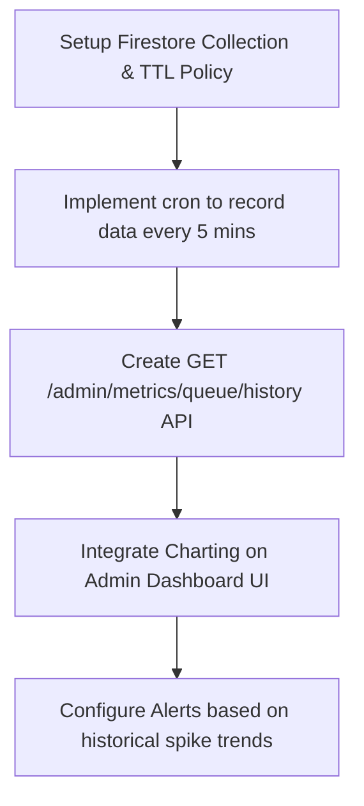

# Requirement Analysis: Cloud Tasks Historical Dashboard

This document outlines the architecture and implementation requirements for tracking and visualizing historical statistics for Cloud Tasks queue metrics.

## 1. Architectural Options

We analyzed three primary approaches to build a historical dashboard:

| Criteria | Option A: GCP Native Cloud Monitoring | Option B: Self-Hosted Scraper (External) | Option C: Internal Firestore Storage (Recommended) | Option D: Grafana Integration (Alternative) |
| :--- | :--- | :--- | :--- | :--- |
| **Data Source** | Google Cloud Monitoring (MQL/GQL) | External Prometheus/Datadog agent | Internal background sync (via cron/scheduler) | GCP Stackdriver or API scrapers |
| **Storage** | Cloud Monitoring Metrics (Included in GCP) | Third-party service | Firestore collection (`queue_metrics_history`) | Prometheus / GCP metrics |
| **Complexity** | High (Requires IAM, MQL query building) | High (Requires external subscription/setup) | Low-Medium (Leverages existing stack) | Medium (Requires setting up Grafana dashboard) |
| **Cost** | Free tier (up to limits), then standard rates | Subscription fee + traffic | Minimal Firestore writes (e.g. 288 writes/day) | Free (if self-hosted Grafana) or Cloud subscription |
| **UI Integration**| GCP Web Console (Not integrated in App UI) | Third-party UI | Fully customizable inside FonMaYang Admin UI | Separate Grafana Dashboard UI |

> [!TIP]
> **Why Option C is recommended:** It allows us to build a seamless admin panel directly inside the application, using only existing tools (Firestore & FastAPI), keeping operations self-contained and cost-efficient.
>
> **Why Option D (Grafana) is a strong alternative:** If we want to avoid coding UI charting components entirely, we can set up Grafana with the Google Cloud Monitoring data source plugin (reading queue metrics directly) or scrape our `/api/v1/metrics/queue` endpoint. This gives us advanced dashboarding, sharing, and alert routing (e.g., Slack/Telegram) out of the box.

---

## 2. Technical Design (Option C)

### A. Ingestion (Data Collection)
- **Mechanism:** A Cloud Scheduler job hits `/api/v1/cron/track-queue-depth` every **5 minutes** (can be configured in `schedulers.json`).
- **Logic:**
  1. Calls the Cloud Tasks API to retrieve the current queue depth.
  2. Creates a document in a new Firestore collection `queue_metrics_history` with schema:
     ```json
     {
       "timestamp": "2026-06-25T02:00:00Z",
       "epoch": 1782353160,
       "depth": 0,
       "location": "asia-southeast1",
       "queue_name": "webhook-worker-queue"
     }
     ```
  3. **TTL (Time to Live):** Configure a Firestore TTL policy on the `timestamp` field to automatically delete entries older than **14 days** to prevent unbounded storage costs (FinOps-friendly).

### B. Backend API API Design
- **Endpoint:** `GET /api/v1/admin/metrics/queue/history`
- **Security:** Requires Admin authentication (e.g., Firebase Auth admin claims or bearer token verification).
- **Query Parameters:**
  - `range`: `24h`, `7d`, `14d` (defaults to `24h`)
- **Response Format:**
  ```json
  {
    "range": "24h",
    "dataPoints": [
      {"timestamp": 1782353160, "depth": 0},
      {"timestamp": 1782353460, "depth": 5}
    ]
  }
  ```

### C. Frontend Dashboard requirements
- **UI Framework/Library:** Chart.js or Recharts (depending on client stack).
- **Widgets:**
  1. **Real-time Queue Depth Card:** Shows current depth + warning banner if depth > 50.
  2. **Historical Line Chart:** Interactive plot of queue depth trends over the selected time range.
  3. **GCP Quick Links:** Shortcuts to the GCP Cloud Tasks console and Cloud Run logs.

---

## 3. Implementation Plan Roadmap


