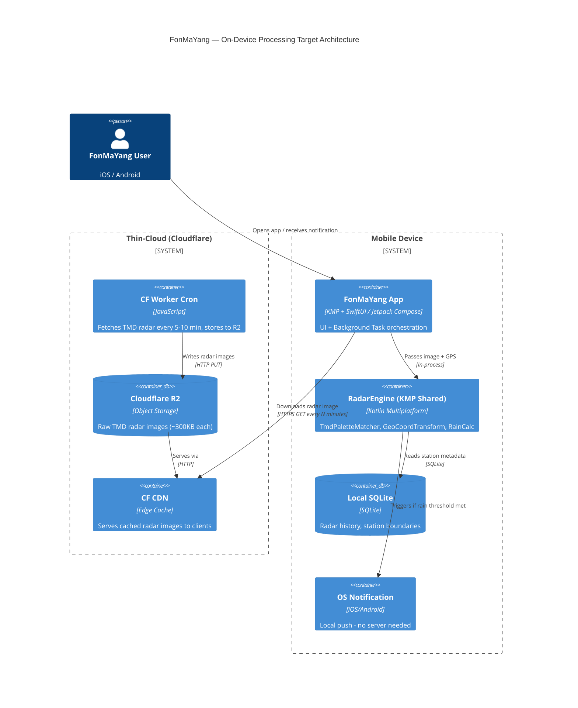
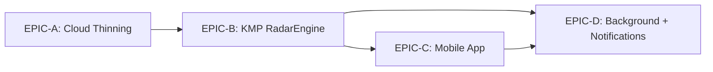

# Epic Planning: On-Device Radar Processing — FonMaYang
> **I'm using the writing-plans + product-manager + architect-review skills to create this breakdown.**
> **⚠️ DO NOT IMPLEMENT until user approves this plan.**

---

## 🎯 Product Vision (JTBD Analysis)

### Who is hiring FonMaYang, and for what job?

| Job Layer | Statement |
| :--- | :--- |
| **Functional Job** | "Know if it will rain at my exact location in the next 30-60 minutes, without opening any app." |
| **Emotional Job** | "Feel in control of my day — never caught unprepared by rain again." |
| **Social Job** | "Be the person who already knew it was going to rain." |

### Current Blocking Force (Why users churn / don't convert):
- **Telegram-only UX**: Limited to chatbot; no persistent background monitoring without server polling every user.
- **Cloud latency cost**: Processing rain detection server-side = cloud bills scale linearly with users.
- **Privacy concern**: User GPS coordinates stored/processed server-side.

### Switch Trigger for this Epic:
> Cloud costs are growing unsustainably. The only architecture that scales cost-sublinearly is one where each user's device processes its own radar data.

---

## 🏛️ Architect Review Summary

### Current Architecture (As-Is)
```
User (Telegram/LINE) → Cloud Run Backend (Python/FastAPI)
                              ↓
                   Scheduler fetches TMD Radar
                              ↓
                   OpenCV/PIL processes image (server CPU)
                              ↓
                   Geospatial check vs user GPS (server)
                              ↓
                   Sends alert via Telegram Bot API
```

**Pain Points:**
- Every user location check = 1 Cloud Run invocation (CPU-seconds ++)
- TMD image fetching + processing runs on cloud even when result is "no rain"
- Egress bandwidth charged per image served to Telegram
- Stateful GPS storage raises PDPA/GDPR concerns

### Target Architecture (To-Be)
```
Cloudflare Worker (Cron) → TMD radar fetch + R2 cache (zero egress cost)
                                        ↓
Mobile App (KMP Core) ← downloads raw radar image directly from R2/CDN
         ↓                                    
   On-device image processing (CoreImage / NDK)
         ↓
   GPS match → dBZ calculation → Local notification
```

**Expected Cost Reduction:**
- Server compute: ~95% reduction (only CDN + CF Worker remains)
- Egress: ~90% reduction (R2 = zero egress; CF CDN = very cheap)
- Privacy: 100% — GPS never leaves device

---

## 📐 C4 Container Diagram (Target State)



---

## 📦 Epic Structure (4 Epics)

```
EPIC-A: Cloud Thinning & CDN Migration
EPIC-B: KMP Shared Core RadarEngine
EPIC-C: Native Mobile App (iOS SwiftUI + Android Jetpack Compose)
EPIC-D: Background Processing & On-Device Notification
```

---

## EPIC-A: Cloud Thinning & CDN Migration
> **Goal:** Replace Cloud Run image processing with Cloudflare Worker + R2 CDN as the sole cloud layer.
> **Issue to create**: Convert #303 to Epic, then create sub-stories.

### Story A1: Cloudflare Worker — TMD Radar Fetcher & R2 Publisher
**As a** system, **I want** a Cloudflare Worker (scheduled cron) that fetches the latest TMD radar images from all active stations and stores them in R2, **so that** mobile clients can download raw images directly without Cloud Run.

#### Tasks:
| ID | Task | Subtasks |
| :-- | :-- | :-- |
| A1-T1 | Design CF Worker fetch schedule and R2 bucket structure | • Define naming convention per station/timestamp<br>• Design TTL/expiry policy (keep last 12 frames per station)<br>• Define R2 CORS policy for mobile clients |
| A1-T2 | Implement CF Worker cron job | • Port existing Python TMD fetch logic to JavaScript/TypeScript<br>• Add retry logic and error alerting<br>• Unit test with Wrangler local dev |
| A1-T3 | Set up CF R2 bucket + CDN public URL | • Create R2 bucket via Wrangler config<br>• Enable CF CDN caching rules (Cache-Control headers)<br>• Validate HTTPS public URLs accessible from iOS/Android |
| A1-T4 | Validate cost & latency vs current Cloud Run | • Benchmark CF Worker invocation cost vs Cloud Run<br>• Measure image delivery latency from Thailand edge nodes<br>• Document cost projection (per 10k daily active users) |

### Story A2: Backend Cloud Run — Reduce Scope to Admin & Auth Only
**As a** system operator, **I want** Cloud Run to handle only admin APIs, Telegram bot webhooks, and auth — removing all radar processing — **so that** compute costs drop dramatically.

#### Tasks:
| ID | Task | Subtasks |
| :-- | :-- | :-- |
| A2-T1 | Audit current Cloud Run endpoints for removability | • List all `/api/v1/*` endpoints and classify: Keep / Remove / Migrate-to-CF<br>• Flag all endpoints that touch TMD images or call scheduler_tasks.py |
| A2-T2 | Remove or stub radar processing endpoints | • Remove or deprecate `/api/v1/radar/*` processing routes<br>• Add deprecation warning headers for 30 days |
| A2-T3 | Move scheduler jobs to Cloudflare Cron Workers | • Migrate `scheduler_tasks.py` radar fetch routines to CF Worker<br>• Update Cloud Scheduler to point to CF Worker trigger instead |

---

## EPIC-B: KMP Shared Core — RadarEngine Library
> **Goal:** Build a single Kotlin Multiplatform library containing all radar math, TMD palette mapping, and coordinate transformation logic — shared across iOS and Android natively.
> **Outcome:** Zero code duplication; one bug fix applies to both platforms.

### Story B1: KMP Project Scaffold & CI Setup
**As a** developer, **I want** a Kotlin Multiplatform project set up with iOS (XCFramework) and Android (AAR) targets and a CI pipeline, **so that** I can build the shared core once and publish to both platforms.

#### Tasks:
| ID | Task | Subtasks |
| :-- | :-- | :-- |
| B1-T1 | Scaffold KMP project structure | • Init with KMP Gradle DSL (targets: `iosArm64`, `iosSimulatorArm64`, `androidTarget`)<br>• Set up `commonMain`, `iosMain`, `androidMain` source sets<br>• Add to `/mobile/radar-engine-kmp/` in repo |
| B1-T2 | Configure XCFramework + AAR build outputs | • Configure `XCFramework` task for iOS<br>• Configure `publishToMavenLocal` for Android AAR<br>• Validate build on macOS CI (GitHub Actions) |

### Story B2: TmdPaletteMatcher — RGB to dBZ Conversion
**As a** mobile app, **I want** a function that takes an RGB pixel value from a TMD radar image and returns the rain intensity (dBZ / Rainfall category), **so that** the app can assess rain severity without a server round-trip.

#### Tasks:
| ID | Task | Subtasks |
| :-- | :-- | :-- |
| B2-T1 | Port TMD color palette definition from Python | • Extract hardcoded palette from `backend/app/services/*.py`<br>• Convert to Kotlin `data class TmdColor(rgb, dBZ, label)` constants<br>• Document source and known palette discrepancies |
| B2-T2 | Implement `TmdPaletteMatcher.match(r, g, b): RainLevel` | • Use nearest-neighbor Euclidean distance in RGB space<br>• Define `RainLevel` enum: `NONE, LIGHT, MODERATE, HEAVY, VERY_HEAVY, EXTREME`<br>• Handle anti-aliased edge pixels (tolerance threshold) |
| B2-T3 | Write unit tests for palette matching | • Test all 6 canonical TMD colors match correct RainLevel<br>• Test edge pixels with ±10 tolerance<br>• Test pure white/background pixels return `NONE` |

### Story B3: GeoCoordinateTransformer — GPS to Pixel XY
**As a** mobile app, **I want** to convert a user's GPS coordinate (Lat/Lng) to a pixel position (X, Y) on a given TMD radar image, **so that** the app can look up the color at the user's location without a server.

#### Tasks:
| ID | Task | Subtasks |
| :-- | :-- | :-- |
| B3-T1 | Port station projection math from Python | • Extract `(lat/lng → pixel XY)` affine transform from existing backend code<br>• Validate against production station configs (BKK/svp240, Chiang Rai/cri, etc.) |
| B3-T2 | Implement `RadarStationProjector.project(lat, lng, station): PixelPoint` | • Define `RadarStation` data class (center_lat, center_lng, km_per_pixel, canvas_width, canvas_height, crop_offset_x, crop_offset_y)<br>• Implement affine projection formula<br>• Return `null` if point is outside station coverage |
| B3-T3 | Write unit tests for coordinate projection | • Test known landmarks (e.g., Don Mueang airport) map to expected pixel range<br>• Test boundary conditions (outside bbox → null)<br>• Test all currently active stations in station DB |

### Story B4: RainIntensityCalculator — Multi-Pixel Sampling & Scoring
**As a** mobile app, **I want** the engine to sample a small area around the user's pixel position and compute an aggregate rain score, **so that** the result is robust to sub-pixel GPS inaccuracy.

#### Tasks:
| ID | Task | Subtasks |
| :-- | :-- | :-- |
| B4-T1 | Implement `RainIntensityCalculator.calculate(image, pixelPoint, radiusPx): RainScore` | • Sample N×N pixel grid around target point<br>• Weight by distance from center<br>• Return dominant `RainLevel` + `RainScore(0.0-1.0)` |
| B4-T2 | Tune sampling radius based on station resolution | • Research TMD station pixel-to-km ratios<br>• Recommend radius = 2-3 px (≈ 1-2 km buffer)<br>• Expose as configurable parameter |

---

## EPIC-C: Native Mobile App
> **Goal:** Build the FonMaYang native mobile app with SwiftUI (iOS) and Jetpack Compose (Android), integrating the KMP RadarEngine library.

### Story C1: App Project Setup & Architecture
**As a** team, **I want** both iOS and Android app projects scaffolded with clean architecture (MVVM + Repository pattern), **so that** KMP RadarEngine integrates cleanly and UI is testable.

#### Tasks:
| ID | Task | Subtasks |
| :-- | :-- | :-- |
| C1-T1 | Scaffold iOS app (SwiftUI + Xcode Project) | • Create new Xcode project under `/mobile/ios/FonMaYang/`<br>• Integrate KMP XCFramework via local reference<br>• Set up MVVM structure: `ViewModel`, `Repository`, `View` |
| C1-T2 | Scaffold Android app (Kotlin + Jetpack Compose + Gradle) | • Create new Android Studio project under `/mobile/android/`<br>• Add KMP AAR dependency<br>• Set up MVVM + Repository architecture |
| C1-T3 | Set up shared API client for image download | • Implement `RadarImageRepository` that downloads from CF R2/CDN<br>• Cache downloaded images locally (max 12 frames)<br>• Implement stale-detection (compare server ETag/Last-Modified) |

### Story C2: Radar Map View
**As a** user, **I want** to see an interactive radar map overlaid on a base map with my current GPS position marked, **so that** I can visually understand rain proximity.

#### Tasks:
| ID | Task | Subtasks |
| :-- | :-- | :-- |
| C2-T1 | Implement radar map view (iOS — SwiftUI + MapKit) | • Overlay TMD radar image as `MKOverlay` on MapKit<br>• Add animated playback of last 6 frames (radar loop)<br>• Mark user GPS pin with rain intensity color indicator |
| C2-T2 | Implement radar map view (Android — Compose + Google Maps) | • Overlay TMD radar image as `TileOverlay` on Google Maps Compose<br>• Add animated playback loop<br>• Mark user GPS pin with rain intensity indicator |

### Story C3: Station Selector & Location Permission
**As a** user, **I want** the app to automatically select the best radar station for my GPS location, **so that** I get the most accurate and highest-resolution radar for my area.

#### Tasks:
| ID | Task | Subtasks |
| :-- | :-- | :-- |
| C3-T1 | Implement station selection logic in KMP (shared) | • Load bundled `stations.json` (station metadata: bbox, center, resolution)<br>• `StationSelector.findBest(lat, lng): RadarStation?` — pick station with highest resolution covering user's GPS |
| C3-T2 | GPS permission request flow (iOS) | • `CLLocationManager` `requestWhenInUseAuthorization()` + `requestAlwaysAuthorization()` for background<br>• Handle denied state gracefully with settings deep-link |
| C3-T3 | GPS permission request flow (Android) | • `ActivityResultContracts.RequestPermission` for `ACCESS_FINE_LOCATION` + `ACCESS_BACKGROUND_LOCATION`<br>• Handle denied state with rationale dialog |

---

## EPIC-D: Background Processing & On-Device Notification
> **Goal:** Enable the app to periodically check for rain at the user's GPS location in the background and fire local OS notifications without any server round-trip.

### Story D1: Background Fetch Scheduler
**As a** system, **I want** the app to wake up every 5-15 minutes in the background, download the latest radar frame, and run the RainEngine, **so that** notifications are proactive even when the app is closed.

#### Tasks:
| ID | Task | Subtasks |
| :-- | :-- | :-- |
| D1-T1 | iOS Background Task Registration (`BGAppRefreshTask`) | • Register `com.fonmayang.radarcheck` background task ID in `Info.plist`<br>• Schedule refresh on `applicationDidEnterBackground`<br>• Implement task handler: download → engine → notify |
| D1-T2 | Android WorkManager Periodic Task | • Define `RadarCheckWorker extends CoroutineWorker`<br>• Schedule `PeriodicWorkRequest` (15-min minimum per Android API)<br>• Handle `BATTERY_NOT_LOW` + `NETWORK_CONNECTED` constraints |
| D1-T3 | Silent Push Notification integration (iOS) | • Configure APNs background push entitlement<br>• CF Worker sends silent push when new radar frame is available<br>• iOS wakes up to fetch and process immediately |

### Story D2: On-Device Rain Alert Notification
**As a** user, **I want** to receive a local notification when rain is detected approaching my location, **so that** I have time to prepare before getting caught in the rain.

#### Tasks:
| ID | Task | Subtasks |
| :-- | :-- | :-- |
| D2-T1 | Implement alert threshold logic in KMP (shared) | • `RainAlertPolicy`: define thresholds per `RainLevel` (e.g., trigger on `MODERATE` or above within 3 km)<br>• Implement cooldown period (don't alert again within 30 min)<br>• Store last alert timestamp in local SQLite |
| D2-T2 | Local notification dispatch (iOS — `UNUserNotificationCenter`) | • Create `UNMutableNotificationContent` with dynamic rain description<br>• Fire immediately via `UNNotificationRequest` with `UNTimeIntervalNotificationTrigger(timeInterval: 0.1)`<br>• Include actionable deep-link to open radar map |
| D2-T3 | Local notification dispatch (Android — `NotificationManager` / `NotificationCompat`) | • Build `NotificationCompat.Builder` with BigTextStyle rain summary<br>• Create `NotificationChannel` for rain alerts<br>• Set high priority for immediate delivery |

### Story D3: Battery & Privacy Guardrails
**As a** user, **I want** the background radar check to consume minimal battery and never upload my GPS coordinates to any server, **so that** I trust the app and don't delete it.

#### Tasks:
| ID | Task | Subtasks |
| :-- | :-- | :-- |
| D3-T1 | Battery optimization compliance | • iOS: Respect `BGAppRefreshTask` time limit (30s max), abort gracefully<br>• Android: Respect `Doze Mode`, use `Expedited Work` only for push-triggered checks<br>• Measure battery drain: < 1% per day in background |
| D3-T2 | Privacy-by-design audit | • Confirm GPS coordinates never leave device<br>• No analytics SDK that captures location<br>• Add privacy manifest (`NSPrivacyAccessedAPITypes`) for iOS 17+ |

---

## 📊 Effort Estimation & Priority Matrix (RICE Scoring)

| Epic | Reach | Impact | Confidence | Effort (dev-weeks) | RICE Score | Priority |
| :--- | :--- | :--- | :--- | :--- | :--- | :--- |
| **EPIC-A: Cloud Thinning** | All users (current) | High — ~90% cost cut | 90% | 2 weeks | 🔥 **HIGH** | 1st |
| **EPIC-B: KMP RadarEngine** | All mobile users | High — foundation for C & D | 85% | 3 weeks | 🔥 **HIGH** | 2nd |
| **EPIC-D: Background Notif** | Mobile users | Very High — core value prop | 80% | 2 weeks | ⚡ **HIGH** | 3rd |
| **EPIC-C: Mobile App UI** | New mobile users | High — UX leap from Telegram | 75% | 4 weeks | ⚡ **MEDIUM-HIGH** | 4th |

---

## 🔗 Dependency Graph



> **Critical Path:** A → B → C/D (EPIC-A and EPIC-B are blockers for everything else)

---

## 📋 GitLab Issues to Create

### Hierarchy Plan

```
[Epic] #303 (upgrade to Epic) — On-Device Radar Processing Initiative

├── [Epic] EPIC-A: Cloud Thinning & CDN Migration
│   ├── [Story] A1: CF Worker TMD Radar Fetcher & R2 Publisher
│   │   ├── [Task] A1-T1: Design CF Worker fetch schedule & R2 bucket structure
│   │   ├── [Task] A1-T2: Implement CF Worker cron job
│   │   ├── [Task] A1-T3: Set up CF R2 bucket + CDN public URL
│   │   └── [Task] A1-T4: Validate cost & latency vs Cloud Run
│   └── [Story] A2: Reduce Cloud Run scope to Admin & Auth only
│       ├── [Task] A2-T1: Audit current Cloud Run endpoints
│       ├── [Task] A2-T2: Remove radar processing endpoints
│       └── [Task] A2-T3: Migrate scheduler jobs to CF Cron Workers
│
├── [Epic] EPIC-B: KMP Shared Core RadarEngine
│   ├── [Story] B1: KMP Project Scaffold & CI Setup
│   ├── [Story] B2: TmdPaletteMatcher — RGB to dBZ
│   │   ├── [Task] B2-T1: Port TMD palette definition from Python
│   │   ├── [Task] B2-T2: Implement TmdPaletteMatcher.match()
│   │   └── [Task] B2-T3: Unit tests for palette matching
│   ├── [Story] B3: GeoCoordinateTransformer — GPS to Pixel XY
│   │   ├── [Task] B3-T1: Port station projection math from Python
│   │   ├── [Task] B3-T2: Implement RadarStationProjector.project()
│   │   └── [Task] B3-T3: Unit tests for coordinate projection
│   └── [Story] B4: RainIntensityCalculator — Multi-Pixel Sampling
│       ├── [Task] B4-T1: Implement RainIntensityCalculator.calculate()
│       └── [Task] B4-T2: Tune sampling radius per station resolution
│
├── [Epic] EPIC-C: Native Mobile App (iOS + Android)
│   ├── [Story] C1: App Project Setup & Architecture
│   ├── [Story] C2: Radar Map View
│   └── [Story] C3: Station Selector & Location Permission
│
└── [Epic] EPIC-D: Background Processing & On-Device Notifications
    ├── [Story] D1: Background Fetch Scheduler
    │   ├── [Task] D1-T1: iOS BGAppRefreshTask
    │   ├── [Task] D1-T2: Android WorkManager Periodic Task
    │   └── [Task] D1-T3: Silent Push Notification integration (iOS)
    ├── [Story] D2: On-Device Rain Alert Notification
    │   ├── [Task] D2-T1: Alert threshold logic in KMP
    │   ├── [Task] D2-T2: Local notification dispatch (iOS)
    │   └── [Task] D2-T3: Local notification dispatch (Android)
    └── [Story] D3: Battery & Privacy Guardrails
```

---

## 🔗 GitLab Issues Reference & Mapping Table

| Layer | Issue ID | Title | Labels |
| :--- | :--- | :--- | :--- |
| **Master Epic** | [#303](https://gitlab.com/oatricedev/FonMaYang/-/work_items/303) | Epic: On-Device Radar Processing Initiative — Thin-Cloud Architecture for FonMaYang | `epic`, `architecture`, `enhancement` |
| **Sub-Epic A** | [#304](https://gitlab.com/oatricedev/FonMaYang/-/work_items/304) | EPIC-A: Cloud CDN Layer — Cloudflare Worker + R2 for Mobile Radar Image Delivery | `epic`, `architecture`, `enhancement`, `devops` |
| **Sub-Epic B** | [#305](https://gitlab.com/oatricedev/FonMaYang/-/work_items/305) | EPIC-B: KMP Shared Core RadarEngine — Kotlin Multiplatform Radar Math Library | `epic`, `architecture`, `enhancement`, `mobile` |
| **Sub-Epic C** | [#306](https://gitlab.com/oatricedev/FonMaYang/-/work_items/306) | EPIC-C: Native Mobile App — iOS SwiftUI + Android Jetpack Compose | `epic`, `enhancement`, `mobile`, `frontend` |
| **Sub-Epic D** | [#307](https://gitlab.com/oatricedev/FonMaYang/-/work_items/307) | EPIC-D: Background Processing & On-Device Rain Notifications — Zero Server Round-Trip | `epic`, `enhancement`, `mobile` |
| **Story A1** | [#308](https://gitlab.com/oatricedev/FonMaYang/-/work_items/308) | Story A1: CF Worker — TMD Radar Fetcher & R2 Publisher | `enhancement`, `devops` |
| **Story B1** | [#309](https://gitlab.com/oatricedev/FonMaYang/-/work_items/309) | Story B1: KMP Project Scaffold & CI Setup for RadarEngine Library | `enhancement`, `mobile` |
| **Story B2** | [#310](https://gitlab.com/oatricedev/FonMaYang/-/work_items/310) | Story B2: TmdPaletteMatcher — RGB Pixel to RainLevel dBZ Conversion (KMP) | `enhancement`, `mobile` |
| **Story B3** | [#311](https://gitlab.com/oatricedev/FonMaYang/-/work_items/311) | Story B3: GeoCoordinateTransformer — GPS Lat/Lng to Radar Pixel XY (KMP) | `enhancement`, `mobile` |
| **Story B4** | [#312](https://gitlab.com/oatricedev/FonMaYang/-/work_items/312) | Story B4: RainIntensityCalculator — Multi-Pixel Neighborhood Sampling & Scoring (KMP) | `enhancement`, `mobile` |
| **Story C1** | [#313](https://gitlab.com/oatricedev/FonMaYang/-/work_items/313) | Story C1: Mobile App Scaffold — MVVM Architecture + KMP Integration (iOS & Android) | `enhancement`, `mobile` |
| **Story C2** | [#314](https://gitlab.com/oatricedev/FonMaYang/-/work_items/314) | Story C2: Radar Map View — Animated TMD Overlay on MapKit (iOS) and Google Maps (Android) | `enhancement`, `mobile`, `frontend` |
| **Story C3** | [#315](https://gitlab.com/oatricedev/FonMaYang/-/work_items/315) | Story C3: Auto Station Selector & GPS Permission Flow (iOS + Android) | `enhancement`, `mobile` |
| **Story D1** | [#316](https://gitlab.com/oatricedev/FonMaYang/-/work_items/316) | Story D1: Background Fetch Scheduler — BGAppRefreshTask (iOS) + WorkManager (Android) | `enhancement`, `mobile` |
| **Story D2** | [#317](https://gitlab.com/oatricedev/FonMaYang/-/work_items/317) | Story D2: On-Device Rain Alert — Local OS Notification with Zero Server Round-Trip | `enhancement`, `mobile` |
| **Story D3** | [#318](https://gitlab.com/oatricedev/FonMaYang/-/work_items/318) | Story D3: Battery Optimization & Privacy-by-Design Audit | `enhancement`, `mobile`, `security` |
| **Tasks A1** | [#319](https://gitlab.com/oatricedev/FonMaYang/-/work_items/319) - [#322](https://gitlab.com/oatricedev/FonMaYang/-/work_items/322) | Task A1-T1 to A1-T4 (Design, Worker TS, R2 Bucket/CDN, Cost Benchmark) | `enhancement`, `devops` |
| **Tasks B2** | [#323](https://gitlab.com/oatricedev/FonMaYang/-/work_items/323) - [#325](https://gitlab.com/oatricedev/FonMaYang/-/work_items/325) | Task B2-T1 to B2-T3 (Port palette, Matcher math, Unit tests) | `enhancement`, `mobile` |
| **Tasks B3** | [#326](https://gitlab.com/oatricedev/FonMaYang/-/work_items/326) - [#328](https://gitlab.com/oatricedev/FonMaYang/-/work_items/328) | Task B3-T1 to B3-T3 (Port affine projection, Projector logic, Unit tests) | `enhancement`, `mobile` |
| **Tasks B4** | [#337](https://gitlab.com/oatricedev/FonMaYang/-/work_items/337) - [#338](https://gitlab.com/oatricedev/FonMaYang/-/work_items/338) | Task B4-T1 to B4-T2 (Distance-weighted sampling, Tune radius per station) | `enhancement`, `mobile` |
| **Tasks D1** | [#329](https://gitlab.com/oatricedev/FonMaYang/-/work_items/329) - [#331](https://gitlab.com/oatricedev/FonMaYang/-/work_items/331) | Task D1-T1 to D1-T3 (iOS BGTask, Android WorkManager, Silent Push / FCM) | `enhancement`, `mobile` |
| **Tasks D2** | [#332](https://gitlab.com/oatricedev/FonMaYang/-/work_items/332) - [#334](https://gitlab.com/oatricedev/FonMaYang/-/work_items/334) | Task D2-T1 to D2-T3 (RainAlertPolicy KMP, iOS Notification, Android Channel) | `enhancement`, `mobile` |
| **Tasks D3** | [#335](https://gitlab.com/oatricedev/FonMaYang/-/work_items/335) - [#336](https://gitlab.com/oatricedev/FonMaYang/-/work_items/336) | Task D3-T1 to D3-T2 (Battery benchmark, Privacy mitmproxy audit) | `enhancement`, `mobile`, `security` |

---

## ✅ Architecture Decisions — RESOLVED (2026-09-16)

| # | Question | Decision |
| :-- | :-- | :-- |
| Q1 | Tech Stack | **KMP + Native UI** (SwiftUI on iOS / Jetpack Compose on Android) |
| Q2 | CDN Provider | **Cloudflare R2** (zero egress) |
| Q3 | Telegram/LINE Bot | **Keep as parallel channel** — NOT deprecated |
| Q4 | MVP Scope | **All 4 Epics in parallel** — existing Cloud Run system stays intact; mobile app is ADDITIVE |

> [!IMPORTANT]
> **Key Constraint**: The existing Cloud Run + Python backend + Telegram/LINE bot is **NOT replaced**. The mobile app and on-device processing is a **new parallel channel**. Nothing in the old system is removed or deprecated.

## ~~⚠️ Open Questions (Before Creating Issues)~~

> [!IMPORTANT]
> **Q1: Tech Stack Decision** — ยืนยัน KMP + Native UI หรือต้องการเปลี่ยนเป็น Flutter/Pure Native?
> การตัดสินใจนี้จะกำหนด Scaffold ใน EPIC-B, C, D ทั้งหมด

> [!IMPORTANT]
> **Q2: Cloud Provider for CDN** — ใช้ Cloudflare Workers + R2 (แนะนำ) หรือต้องการคงอยู่บน GCP (Cloud Storage + Cloud CDN) เพื่อใช้ Free Tier ที่มีอยู่?

> [!NOTE]
> **Q3: Telegram Bot Role** — หลังจากมี Mobile App แล้ว Telegram bot จะยังคง serve as primary notification channel สำหรับ non-mobile users หรือ deprecate?

> [!NOTE]
> **Q4: MVP Scope** — ต้องการให้ MVP (Minimum Viable Product) ประกอบด้วย Epic ใดบ้าง? แนะนำ A + B เป็น Phase 1 เพื่อลดต้นทุนก่อน แล้วค่อยทำ C + D ใน Phase 2

---

## ✅ Evaluation Criteria (Pre-Implementation Checklist)

> [!NOTE]
> ใช้ criteria นี้ก่อน approve implementation ของแต่ละ Story

- [ ] ADR document referenced (ดูเพิ่มใน `docs/on_device_architecture_decision.md`)
- [ ] Acceptance Criteria ของแต่ละ Story ชัดเจน, testable, และ measurable
- [ ] Dependency เรียงถูกต้อง (ไม่มี Story ลูกที่ทำก่อน Story พ่อ)
- [ ] Effort estimate ได้รับการ review จากทีมก่อน Sprint Planning
- [ ] Open Questions ทั้ง 4 ข้อได้รับคำตอบก่อนสร้าง Issues ใน GitLab
