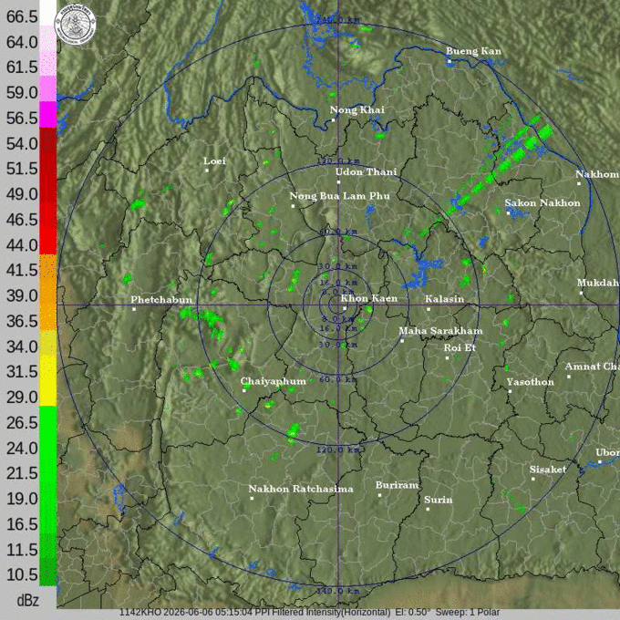
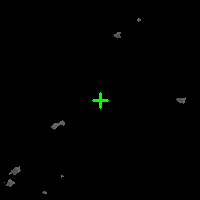
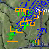
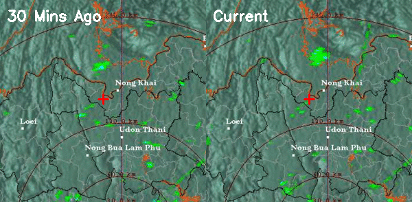
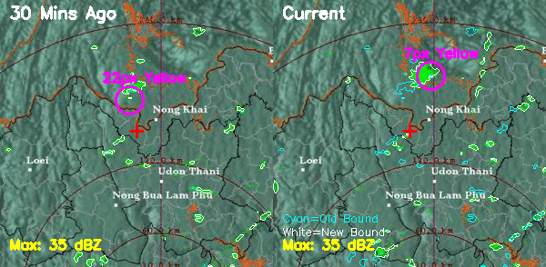
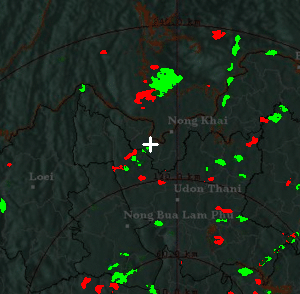
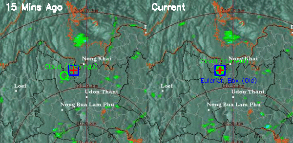

**Manual Verification Guide**

- **Step 1:** เปิดแอป Telegram และส่งคำสั่ง `/devmock rain` (หากคุณเป็น Developer) หรือเลือกพิมพ์/ส่ง Location (พิกัด) ไปยังบอท โดยเลือกพิกัดที่อยู่ในเขตครอบคลุมของเรดาร์ TMD (เช่น พื้นที่ขอนแก่นหรือสกลนคร) 
- **Step 2:** รอให้บอทประมวลผลข้อความพยากรณ์ฝน สังเกตที่ข้อความตอบกลับ ว่ามีบรรทัด "แนวโน้มกลุ่มฝน" (Growth/Decay Trend) แสดงผลอัตราเปอร์เซ็นต์อย่างชัดเจนหรือไม่ (เช่น 📈 กำลังก่อตัวแรงขึ้น หรือ 📉 อ่อนกำลังลง)
- **Step 3:** ตรวจสอบว่ามีไฟล์ `radar_nowcast.gif` ถูกส่งกลับมาด้วยหรือไม่ ให้เปิดดูภาพเคลื่อนไหวนั้น
- **Expected Result:** ข้อความต้องแสดง % แนวโน้มฝนได้อย่างถูกต้อง (ไม่เป็น None หรือ Error) และไฟล์ GIF ต้องแสดงผลภาพเรดาร์เคลื่อนไหว พร้อมกับมี "หมุดกากบาทวงกลมสีแดง" (Red Pin) ปักอยู่ตรงตำแหน่งที่คุณส่งพิกัดไปอย่างชัดเจนและถูกต้องตามตำแหน่งบนแผนที่

### Optical Flow Validation
การคำนวณความเร็วและทิศทางลมถูกปรับปรุงให้ใช้เฉพาะพิกเซลเมฆฝน (Rain Mask) เพื่อลดสัญญาณรบกวนจากแผนที่พื้นหลัง และใช้ Normalized Convolution ขยายขอบเขตความเร็วลมเพื่อพยากรณ์เมฆที่กำลังเคลื่อนที่เข้าหาพิกัดเป้าหมาย

- **ภาพถ่ายเรดาร์ต้นฉบับ:**
  

- **การประมวลผลเมฆฝน (Rain Only Mask):**
  แสดงพิกเซลเมฆฝนที่ผ่านการสกัดสี และทำแอนิเมชันเพื่อตรวจสอบการเคลื่อนไหว
  

- **การคำนวณทิศทางลมและจัดกลุ่มเมฆฝน:**
  แสดงการตีกรอบ (Bounding Box) และลูกศรทิศทางลมที่ได้จากการคำนวณ Optical Flow ของเมฆแต่ละก้อน
  

### 🌧️ Lagrangian Growth vs Eulerian Growth (Important Physics Fix)
จากการทำ User Verification อย่างละเอียด พบว่าการประเมินการเติบโต/หดตัวของเมฆ (Growth/Decay Trend) เดิมที่ใช้ **Eulerian Approach** (การตีกล่องขนาดคงที่รอบๆ พิกัดเป้าหมายแล้วหาผลรวมมวลน้ำในสองช่วงเวลา) ทำให้เกิดข้อผิดพลาดรุนแรง (False Positive) กล่าวคือ เมื่อเมฆฝนถูกลมพัดเข้ามาในเขตกล่อง ระบบจะคำนวณว่า "มวลน้ำเพิ่มขึ้น = เมฆกำลังเติบโต (Growth)" ทั้งที่จริงๆ แล้วเมฆก้อนนั้นความแรงเท่าเดิม แค่เคลื่อนที่ (Advection) เข้ามาในพื้นที่

**การแก้ไขทางฟิสิกส์ (Physics Fix):**
ระบบจึงถูกออกแบบสมการใหม่ให้ใช้ **Lagrangian Approach** (การติดตามมวลอากาศเป้าหมายข้ามเวลา) โดย:
1. คำนวณหาว่ามวลอากาศก้อนไหน (พิกเซลไหน) ที่จะพัดมาโดนพิกัดของผู้ใช้ในอนาคต (แกะรอยไปตาม Optical Flow Vector)
2. แกะรอยพิกเซลเป้าหมายนั้นย้อนหลัง (Back-tracking) ว่ามวลอากาศกลุ่มนี้อยู่ที่ไหนบนภาพเมื่อ 15 นาที และ 30 นาทีที่แล้ว
3. นำค่าความแรงฝน (dBZ) ของมวลอากาศกลุ่มเดิมมาเปรียบเทียบกันข้ามเวลา เพื่อดูว่าก้อนนี้เติบโต (Intensification) หรือหดตัว (Dissipation) จริงๆ อย่างแม่นยำ

#### 1. การเปรียบเทียบภาพเรดาร์ดิบ (Raw Comparison)

#### 2. การวิเคราะห์มวลน้ำและความรุนแรงในเชิงลึก (Pixel-by-pixel Analysis)
การวิเคราะห์อย่างละเอียด (ในภาพ) พบว่าขนาดของเมฆขยายใหญ่ขึ้นก็จริง (+50.6%) แต่แกนกลางความรุนแรงสีเหลืองกลับมีพื้นที่ลดลง (-68.2%) บ่งชี้ให้เห็นชัดเจนว่าพายุมีการกระจายวงกว้างแต่อ่อนกำลังลง (Decay) ไม่ใช่แข็งแกร่งขึ้น

#### 3. การประเมินพื้นที่เติบโตของเมฆแบบภาพรวม (Global Cloud Growth)
ภาพแสดงพื้นที่ที่เมฆมีการก่อตัวเพิ่มขึ้น (สีเขียว) และอ่อนกำลังลง (สีแดง) ทั่วทั้งเฟรมเรดาร์

#### 4. หลักฐานการประเมินแบบแกะรอยมวลอากาศ (Lagrangian Tracking Evidence)
วงกลมสีเขียว (Lagrangian) ชี้ให้เห็นว่ามวลอากาศก้อนเป้าหมายที่จะพัดมาโดนพิกัดผู้ใช้ มีการเติบโตที่ระดับ 0.0% (คงที่) ตลอดช่วง 15 นาที ในขณะที่กล่องสีฟ้า (Eulerian) ถูกทัศนวิสัยหลอกว่าเติบโตถึง 91.7%

