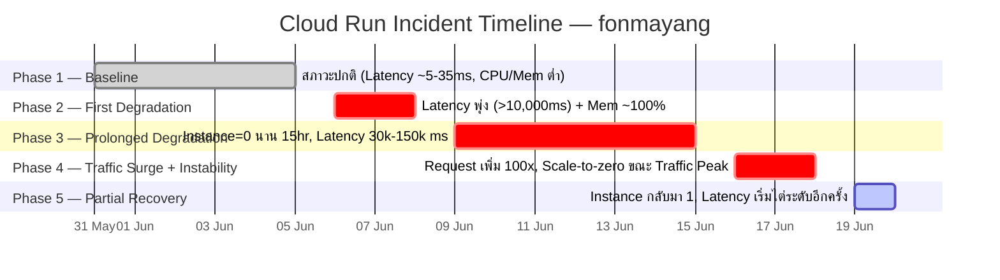
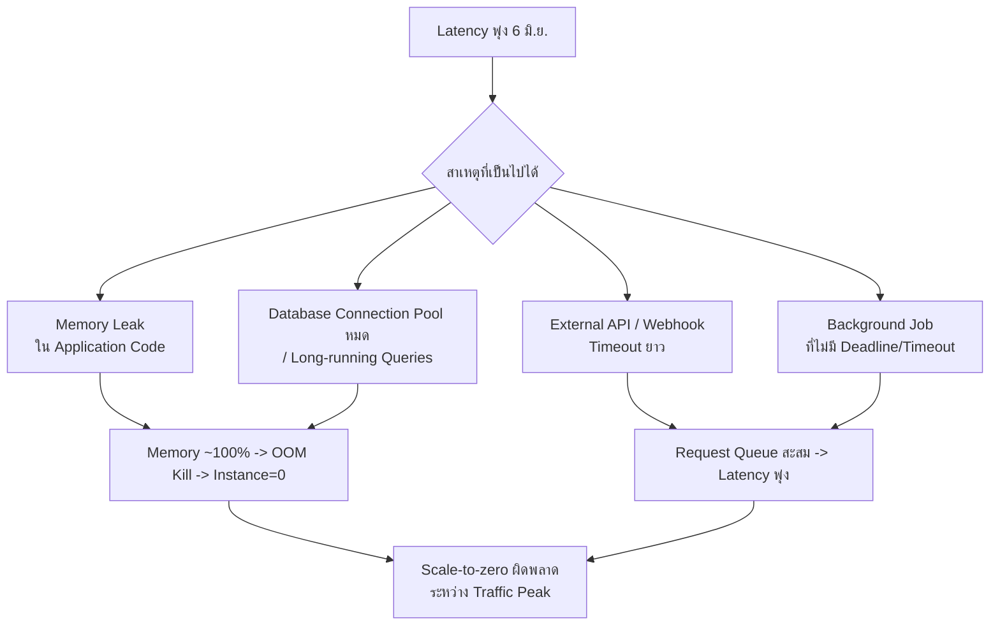

# 📊 Cloud Run Metrics Analysis — fonmayang
**ช่วงเวลา:** 31 พ.ค. 2026 – 20 มิ.ย. 2026  
**สร้างเมื่อ:** 20 มิ.ย. 2026 (09:13 ICT)

---

## 🗓️ Timeline Overview

---

## 📋 Phase-by-Phase Detail

### ✅ Phase 1: 31 พ.ค. – 5 มิ.ย. — Baseline (สภาวะปกติ)

| Metric | ค่าที่สังเกต |
|---|---|
| Request Count | ~0.003 – 0.005 (ต่ำมาก) |
| Latency (avg) | 5 – 35 ms |
| Instance Count | ~1 instance |
| CPU Utilization | ~0.005 |
| Memory Utilization | ~0.24 – 0.35 |

**สรุป:** ระบบทำงานปกติ เสถียร ทรัพยากรใช้งานน้อยมาก

---

### ⚠️ Phase 2: 6 มิ.ย. – 8 มิ.ย. — จุดเริ่มต้นปัญหา

| เวลา | เหตุการณ์ |
|---|---|
| 6 มิ.ย. ~19:00 | Latency พุ่งจาก ~35ms → **10,224 ms** |
| 6 มิ.ย. ดึก | Memory Utilization แตะ **~1.0 (≈100%)** |
| 7 – 8 มิ.ย. | Latency ทวีความรุนแรง → **50,000 – 279,000 ms** |

> [!WARNING]
> Latency พุ่งแม้ Request Count ยังต่ำเท่าเดิม → ปัญหาไม่ได้เกิดจาก Traffic แต่เกิดจาก **ปัญหาภายในแอปพลิเคชัน** (Memory Leak, Deadlock, หรือ I/O Blocking)

---

### 🔴 Phase 3: 9 มิ.ย. – 15 มิ.ย. — ยืดเยื้อ + Instance หาย

| เวลา | เหตุการณ์ |
|---|---|
| 9 มิ.ย. 02:00–17:00 | **Instance Count = 0 นาน 15 ชั่วโมง** |
| 9 มิ.ย. ค่ำ | Instance กลับมา 1 ตัว |
| 10 – 12 มิ.ย. | Latency ยังสูง 30,000 – 80,000 ms |
| 13 – 14 มิ.ย. ดึก | **Latency ทะลุ 150,000 ms** (สถิติสูงสุด) |

> [!CAUTION]
> การที่ Instance = 0 นาน 15 ชั่วโมงทั้งที่มี Request เข้ามา อาจหมายความว่า Instance เกิด **OOM Crash** หรือ **Health Check Failure** ซ้ำๆ จนถูก Cloud Run ถอดออกทั้งหมด

---

### 🚨 Phase 4: 16 มิ.ย. – 18 มิ.ย. — Traffic พุ่ง + ระบบแปรปรวน

| วันที่ | เหตุการณ์ |
|---|---|
| 16 มิ.ย. บ่าย (15:00–17:00) | Latency **ลดฉับพลัน** → 5–90 ms |
| 16 มิ.ย. ค่ำ | Request Count พุ่ง **0.148 – 0.349** (+100x จาก Baseline) |
| 17 มิ.ย. 09:00–10:00 | **Instance = 0 อีกครั้ง** ขณะ Traffic หนาแน่น |
| 18 มิ.ย. ทั้งวัน | Request สูงสุด **0.25 – 0.40** |
| 18 มิ.ย. 04:00–10:00 | **Instance = 0 ขณะ Traffic Peak** + Latency 5–9 ms |

> [!IMPORTANT]
> Latency ต่ำผิดปกติ (5–9 ms) ขณะ Instance = 0 บ่งชี้ว่า Request ถูก **ตัดทิ้งที่ Load Balancer** (ส่ง Error กลับทันทีโดยไม่รอ Instance) อาจเป็น HTTP 503 หรือ Connection Reset

---

### 🟡 Phase 5: 19 มิ.ย. – 20 มิ.ย. — เริ่มทรงตัว แต่ยังน่ากังวล

| Metric | ค่าที่สังเกต |
|---|---|
| Request Count | ~0.01 (ลดจาก Peak แต่ยังสูงกว่า Baseline) |
| Instance Count | 1 instance (บางช่วง scale ถึง 1.8) |
| Latency | **10,000 – 38,000 ms** (เริ่มไต่ระดับอีกครั้ง) |

> [!WARNING]
> แนวโน้ม Latency ที่เริ่มไต่ระดับซ้ำ บ่งชี้ว่า **ปัญหา Root Cause ยังไม่ได้รับการแก้ไข** และอาจเกิด Cycle ซ้ำได้อีก

---

## 🔬 Root Cause Hypotheses

### ข้อสังเกตสำคัญ

| สัญญาณ | Root Cause ที่น่าสงสัย |
|---|---|
| Latency พุ่งก่อน Traffic เพิ่ม | Memory Leak หรือ Background Process ที่สะสม |
| Memory ~100% ก่อน Crash | Object/Connection ที่ไม่ถูก Release |
| Instance=0 ระหว่าง Traffic Peak | OOM Kill หรือ Health Check Timeout |
| Latency ต่ำมากขณะ Instance=0 | Load Balancer ส่ง 503 ทันที |
| Latency ไต่ระดับซ้ำใน Phase 5 | ปัญหา Root Cause ยังไม่ได้แก้ |

---

## 🛠️ Recommended Actions

### Priority 1 — ตรวจสอบทันที 🔴

- [ ] **ตรวจ Cloud Run Logs** ช่วง 6 มิ.ย. 19:00 และ 9 มิ.ย. 02:00 สำหรับ `OOMKilled`, `SIGKILL`, หรือ Error Messages
- [ ] **ตรวจ Error Rate** ของ Phase 4 (16–18 มิ.ย.) เพื่อยืนยันว่าเกิด 503 จาก LB จริงหรือไม่
- [ ] **ตรวจ Active DB Connections / Queries** ที่ค้างอยู่ (ถ้าใช้ Firestore/Cloud SQL)

### Priority 2 — แก้ไขระยะสั้น 🟡

- [ ] **ตั้ง Memory Limit** ที่ชัดเจนและ Request Timeout บน Cloud Run
- [ ] **เพิ่ม Min Instances = 1** เพื่อป้องกัน Cold Start ขณะ Traffic เพิ่ม
- [ ] **ตรวจสอบ Background Workers** ว่ามีการกำหนด Deadline/Timeout ครบถ้วน
- [ ] **เปิด Cloud Run Request Logging** เพื่อดู Response Code จริง

### Priority 3 — ป้องกันระยะยาว 🟢

- [ ] **ตั้ง Alert** เมื่อ Memory Utilization > 80% หรือ Latency P95 > 5,000 ms
- [ ] **Load Test** ก่อน Traffic จริงเพิ่มขึ้น เพื่อหา Breaking Point
- [ ] **Review Memory Management** ในโค้ด (Connection Pools, Caching, Event Listeners)
- [ ] **ตั้ง Autoscaling Min/Max** ให้สอดคล้องกับ Traffic Pattern ที่สังเกตได้

---

## 📈 Key Metrics Summary

| Phase | วันที่ | Request Count | Latency (Max) | Instance | สถานะ |
|---|---|---|---|---|---|
| 1 - Baseline | 31 พ.ค. – 5 มิ.ย. | 0.003–0.005 | ~35 ms | 1 | ✅ ปกติ |
| 2 - First Degradation | 6–8 มิ.ย. | ต่ำ (เหมือนเดิม) | **279,000 ms** | 1 | 🔴 วิกฤต |
| 3 - Prolonged | 9–15 มิ.ย. | ต่ำ | **150,000+ ms** | **0** (15hr) | 🔴 วิกฤต |
| 4 - Traffic Surge | 16–18 มิ.ย. | **0.40** (+100x) | 150,000+ ms | **0** (Peak) | 🚨 วิกฤต |
| 5 - Recovery | 19–20 มิ.ย. | ~0.01 | 38,000 ms | 1–1.8 | 🟡 กำลังฟื้นตัว |

---

## 🔗 Related Documents

- [Root Cause Analysis](./root_cause_analysis.md) — การวิเคราะห์เชิงลึก, Git Correlation, Code-level findings
- [ROADMAP.md](./ROADMAP.md) — แผนงานโปรเจกต์
- GitLab Issues: #102–#108 (สร้างจาก RCA นี้)
