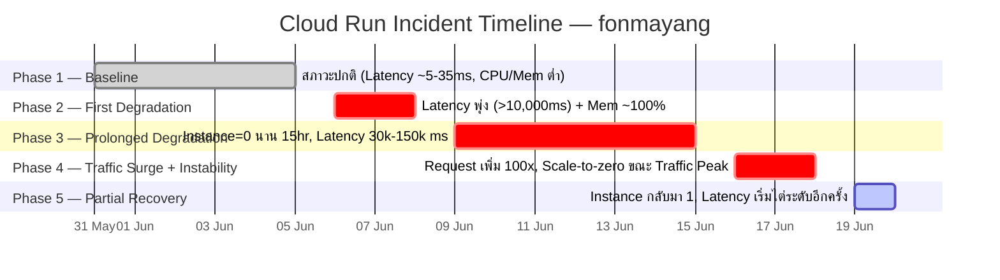

# 📊 Cloud Run Metrics Analysis — fonmayang
**ช่วงเวลา:** 31 พ.ค. 2026 – 20 มิ.ย. 2026
**สร้างเมื่อ:** 20 มิ.ย. 2026 | **อ้างอิง RCA:** [root_cause_analysis.md](./root_cause_analysis.md)

---

## 🗓️ Timeline Overview

---

## 📋 Phase-by-Phase Detail

### ✅ Phase 1: 31 พ.ค. – 5 มิ.ย. — Baseline (สภาวะปกติ)

| Metric | ค่าที่สังเกต |
|---|---|
| Request Count | ~0.003 – 0.005 |
| Latency (avg) | 5 – 35 ms |
| Instance Count | ~1 instance |
| CPU Utilization | ~0.005 |
| Memory Utilization | ~0.24 – 0.35 |

**สรุป:** ระบบทำงานปกติ เสถียร ทรัพยากรใช้งานน้อยมาก

---

### ⚠️ Phase 2: 6 มิ.ย. – 8 มิ.ย. — จุดเริ่มต้นปัญหา

**Trigger:** commit `11000bb` (v0.19–v0.22) — เพิ่ม TMD Radar + EMSC WebSocket ใน lifespan

| เวลา | เหตุการณ์ |
|---|---|
| 6 มิ.ย. ~19:00 | Latency พุ่งจาก ~35ms → **10,224 ms** |
| 6 มิ.ย. ดึก | Memory Utilization แตะ **~1.0 (≈100%)** |
| 7 – 8 มิ.ย. | Latency ทวีความรุนแรง → **50,000 – 279,000 ms** |

> [!WARNING]
> Latency พุ่งแม้ Request Count ยังต่ำเท่าเดิม — ปัญหาไม่ได้เกิดจาก Traffic แต่เกิดจาก **EMSC WebSocket Memory Leak + Radar GIF Generation** ที่สะสม Memory ใน process เดียวกัน

---

### 🔴 Phase 3: 9 มิ.ย. – 15 มิ.ย. — ยืดเยื้อ + Instance หาย

| เวลา | เหตุการณ์ |
|---|---|
| 9 มิ.ย. 02:00–17:00 | **Instance Count = 0 นาน 15 ชั่วโมง** (OOM Kill) |
| 9 มิ.ย. ค่ำ | Instance กลับมา 1 ตัว |
| 10 – 12 มิ.ย. | Latency ยังสูง 30,000 – 80,000 ms |
| 13 – 14 มิ.ย. ดึก | **Latency ทะลุ 150,000 ms** (สถิติสูงสุด) |

> [!CAUTION]
> Instance = 0 นาน 15 ชั่วโมง — Instance เกิด OOM Crash ซ้ำๆ จนถูก Cloud Run ถอดออกทั้งหมด เนื่องจาก Memory limit เดิมตั้งไว้ต่ำเกินไปและ EMSC WS ยังทำงานอยู่ใน main process

---

### 🚨 Phase 4: 16 มิ.ย. – 18 มิ.ย. — Traffic พุ่ง + ระบบแปรปรวน

**Trigger:** v0.27 ย้าย Background Tasks → Cloud Tasks ทำให้ Request Volume เพิ่มขึ้น 100x

| วันที่ | เหตุการณ์ |
|---|---|
| 16 มิ.ย. บ่าย (15:00–17:00) | Latency **ลดฉับพลัน** → 5–90 ms |
| 16 มิ.ย. ค่ำ | Request Count พุ่ง **0.148 – 0.349** (+100x จาก Baseline) |
| 17 มิ.ย. 09:00–10:00 | **Instance = 0 อีกครั้ง** ขณะ Traffic หนาแน่น |
| 18 มิ.ย. ทั้งวัน | Request สูงสุด **0.25 – 0.40** |
| 18 มิ.ย. 04:00–10:00 | **Instance = 0 ขณะ Traffic Peak** + Latency 5–9 ms |

> [!IMPORTANT]
> Latency ต่ำผิดปกติ (5–9 ms) ขณะ Instance = 0 บ่งชี้ว่า Request ถูก **ตัดทิ้งที่ Load Balancer ด้วย HTTP 503** ไม่ได้รับการประมวลผลจริง เกิดจาก `min-instances=0` + `timeout=60s` ที่สั้นเกินไป

---

### 🟡 Phase 5: 19 มิ.ย. – 20 มิ.ย. — เริ่มทรงตัว แต่ยังน่ากังวล

**Hotfixes applied:** v0.30 (disable EMSC WS) + v0.32 (Memory 1GiB + cpu-throttling)

| Metric | ค่าที่สังเกต |
|---|---|
| Request Count | ~0.01 (ลดจาก Peak แต่ยังสูงกว่า Baseline) |
| Instance Count | 1 instance (บางช่วง scale ถึง 1.8) |
| Latency | **10,000 – 38,000 ms** (เริ่มไต่ระดับอีกครั้ง) |

> [!WARNING]
> Latency ไต่ระดับซ้ำ — Root Cause ยังไม่ได้รับการแก้ไขครบถ้วน โดยเฉพาะ `gif_bytes` NameError (180+ ครั้ง/session) และ `render_hq_png` Coroutine Leak ที่ยังรันอยู่

---

## 📈 Key Metrics Summary

| Phase | วันที่ | Request Count | Latency (Max) | Instance | สถานะ |
|---|---|---|---|---|---|
| 1 - Baseline | 31 พ.ค. – 5 มิ.ย. | 0.003–0.005 | ~35 ms | 1 | ✅ ปกติ |
| 2 - First Degradation | 6–8 มิ.ย. | ต่ำ (เหมือนเดิม) | **279,000 ms** | 1 | 🔴 วิกฤต |
| 3 - Prolonged | 9–15 มิ.ย. | ต่ำ | **150,000+ ms** | **0** (15hr) | 🔴 วิกฤต |
| 4 - Traffic Surge | 16–18 มิ.ย. | **0.40** (+100x) | 150,000+ ms | **0** (Peak) | 🚨 วิกฤต |
| 5 - Recovery | 19–20 มิ.ย. | ~0.01 | 38,000 ms | 1–1.8 | 🟡 กำลังฟื้นตัว |

---

## 🔗 Related Documents

- [Root Cause Analysis](./root_cause_analysis.md) — การวิเคราะห์เชิงลึก, Git Correlation, Code-level findings
- [ROADMAP.md](./ROADMAP.md) — แผนงานโปรเจกต์
- GitLab Issues: #102–#108 (สร้างจาก RCA นี้)
