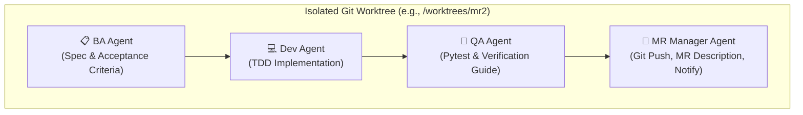

# Multi-Issue Merge Request (MR) Grouping & Batching Guide

This guide establishes the rules and best practices for grouping and batching multiple GitLab issues into single Merge Requests (MRs) while actively avoiding the pitfalls of Large MRs and High Complexity.

---

## ⚖️ Core Principles

1. **Atomic but Cohesive**: Group only tightly-related issues (e.g., a schema change and its direct API controller implementation) that make logical sense to review together.
2. **Keep it Small (Strict Limits)**:
   - **Line Limit**: Maximum of 300-500 lines of code changed per MR (excluding auto-generated code like migrations or lockfiles).
   - **File Limit**: Maximum of 8-10 files changed.
3. **Separation of Concerns**: Do not mix structural database migrations, critical security fixes, and complex UI enhancements into the same MR.

---

## 🛠️ Batching & Grouping Workflow

### 1. Evaluate & Group
Before starting, evaluate the target issues:
- **Low Complexity + Small MR**: Multiple issues can be batched safely (e.g., 3 minor text/UI tweaks).
- **High Complexity / Large MR**: MUST be isolated into its own MR. Never batch complex issues with other tasks.

### 2. Branching Strategy
- Use a batch branch if working on related issues concurrently:
  - Branch name format: `batch/feature-name-or-issues`
  - Merge individual sub-feature branches into the batch branch first, test them together, then open a single MR from `batch/...` to `main`.

### 3. MR Templates & Ticket Tracking
- Every MR description must list all resolved issue IDs clearly using the GitLab notation (e.g., `Closes #187, Closes #188`).
- Clearly demarcate which files or commits belong to which issue in the MR description.

---

## 🚨 Risk Mitigation & Rollbacks

- **Feature Flags**: Wrap new or high-risk features in dynamic feature flags or circuit breakers so they can be turned off without reverting the entire MR.
- **Independent Testing**: Write unit tests for each issue's code separately.
- **Rollback Protocol**: If one issue in a batched MR fails validation, revert the whole MR, split the failing issue out, and re-submit the successful ones.

---

## 🌿 Parallel Multi-MR Execution via Git Worktrees & 4-Role Squad Matrix

To accelerate development across non-conflicting MRs (e.g. MR 2, MR 3, MR 4), developers and AI agents utilize **Git Worktrees** and a **4-Role Squad Matrix**:



### 1. Worktree Isolation Setup
Each parallel MR runs in an isolated directory to avoid code collisions:
```bash
git worktree add ../fonmayang-worktrees/mr2 -b feat/192-zero-pii-stripe-webhook main
git worktree add ../fonmayang-worktrees/mr3 -b feat/193-194-anon-auth-recovery main
git worktree add ../fonmayang-worktrees/mr4 -b feat/191-195-budget-jars-runway main
```

### 2. 4-Role Squad Matrix Responsibilities
- **📋 BA Agent**: Uses `glab issue view <issue_number>` to extract specs, business rules, and updates `task_plan.md`.
- **💻 Dev Agent**: Follows Test-Driven Development (`tdd-workflow`) writing unit tests first before backend code.
- **🧪 QA Agent**: Runs full test suites, edge case validation, and generates `walkthrough.md` and `manual_verification.md`.
- **🚀 MR Manager Agent**: Pushes the branch, composes MR description, and triggers Telegram `notify_pending_review` for human review.

