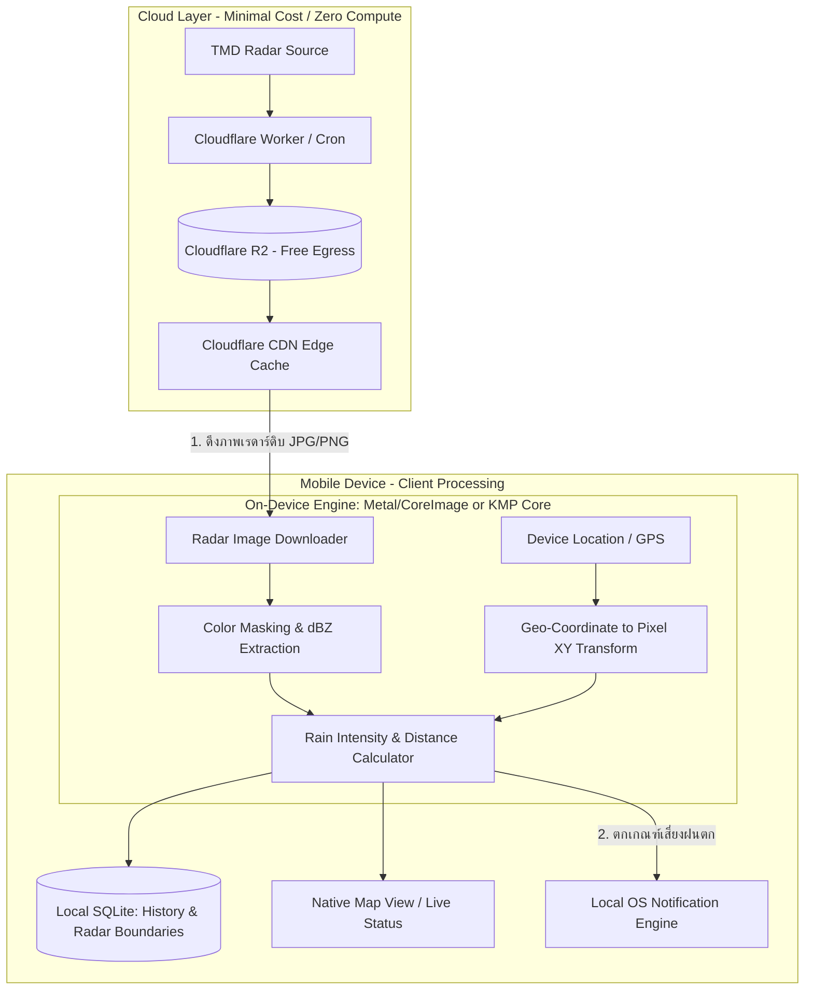

# Architecture Decision Record: On-Device Processing & Tech Stack Comparison for FonMaYang

## 1. บทสรุปและเหตุผล (Executive Summary)
เพื่อแก้ไขปัญหาค่าใช้จ่าย Cloud (Compute & Egress) ที่สูงขึ้น แนวทางคือการเปลี่ยนสถาปัตยกรรมจาก **Server-Heavy Processing** ไปเป็น **Edge/On-Device Computing (Decentralized Architecture)**
- **Cloud Role**: ทำหน้าที่เพียง Fetcher & CDN ให้บริการ Raw Radar Images (Static assets)
- **Client Role**: รับผิดชอบ Image Processing, Coordinate Mapping, Rain Intensity Calculation, และแจ้งเตือน Local Notification ทั้งหมดบนอุปกรณ์ของผู้ใช้

---

## 2. ตารางเปรียบเทียบแต่ละวิธี (Comprehensive Comparison Matrix)

| มิติการเปรียบเทียบ / เกณฑ์ | 1. Pure Native (Swift + Kotlin) | 2. Kotlin Multiplatform (KMP) + Native UI (SwiftUI / Compose) | 3. Flutter (Dart + C++/FFI) | 4. React Native (TS + JSI / Nitro) |
| :--- | :--- | :--- | :--- | :--- |
| **ประสิทธิภาพการประมวลผลภาพ (Image / Pixel Processing)** | **ดีเยี่ยมที่สุด (A+)** Metal, CoreImage, Accelerate, NDK C++ เข้าถึง GPU/ANE โดยตรง | **ดีเยี่ยม (A)** Core Logic รัน Native, ดึง Native Image API ของแต่ละ OS | **ดีมาก (B+)** รันผ่าน `dart:ffi` / C++ (OpenCV), มี overhead เล็กน้อย | **ปานกลาง (B)** ต้องใช้ JSI / C++ bridge, ไม่เหมาะกับการวน Loop พิกเซลบน JS |
| **ความเสถียรของ Background Tasks & Geofencing** | **เสถียรสูงสุด (A+)** `BGAppRefreshTask`, Silent Push, WorkManager ตาม OS spec | **เสถียรสูงสุด (A+)** ผูกกับ Native Lifecycle & Background APIs ได้ตรง 100% | **ปานกลาง (B-)** Flutter Engine ต้องบูตขึ้นมาใน background กินแรมสูง เสี่ยงโดน OS ฆ่า | **ปานกลาง (C+)** การรัน Headless JS background มักเจอปัญหา Timeout และข้อจำกัด OS |
| **การจัดการ Memory (Image Buffers / Decode)** | **ดีเยี่ยมที่สุด** คุม Memory Lifecycle ของ Bitmap/PixelBuffer ได้ระดับละเอียดสุด | **ดีเยี่ยม** จัดการ Buffer ในระดับ Native Memory | **ปานกลาง** ต้องระวังเรื่อง Image Cache ใน Flutter Engine และ GC | **ต้องระวัง** เสี่ยง Out of Memory (OOM) ง่ายหาก decode ภาพเรดาร์ซ้อนหลายเฟรม |
| **การนำ Logic กลับมาใช้ซ้ำ (Code Reusability)** | **ต่ำ (0-10%)** ต้องเขียน Business Logic & Math ซ้ำทั้ง Swift และ Kotlin | **สูงมาก (70-80%)** แชร์ Radar Engine, TMD Parser, Math Transform ได้ชุดเดียว | **สูงมาก (85-95%)** เขียนครั้งเดียวได้ทั้ง UI และ Logic บนทั้งสอง OS | **สูงมาก (80-90%)** เขียนครั้งเดียวได้ทั้งสอง OS ยกเว้นโมดูล Native |
| **ความเร็วในการพัฒนา (Time to Market)** | **ช้าที่สุด** เหมือนพัฒนา 2 โปรเจกต์คู่ขนาน | **ปานกลาง-เร็ว** เขียน Core ชุดเดียว แล้วแยกทำ UI แต่ละฝั่ง | **เร็วมาก** Hot Reload, UI ชุดเดียวทั้ง iOS/Android | **เร็วมาก** ใช้คอมมูนิตี้และไลบรารี JS/TS ที่มีอยู่ได้ทันที |
| **App Bundle Size** | **เล็กที่สุด (~5 - 15 MB)** | **เล็กมาก (~10 - 20 MB)** | **ปานกลาง (~25 - 45 MB)** | **ปานกลาง (~30 - 50 MB)** |
| **ความเหมาะสมกับ FonMaYang ในระยะยาว** | ⭐⭐⭐⭐ (เน้น Performance & Battery สูงสุด แต่ต้นทุนแรงพัฒนาสูง) | ⭐⭐⭐⭐⭐ **(แนะนำสูงสุด)** (สมดุลเลิศ: Logic เรดาร์ชุดเดียว + รีดพลัง Native HW เต็มที่) | ⭐⭐⭐⭐ (เหมาะถ้ามีทีมน้อยและอยากคุม UI จุดเดียว) | ⭐⭐⭐ (ไม่ค่อยเหมาะกับงาน Image Processing หนักๆ) |

---

## 3. เจาะลึกจุดเด่น-จุดด้อยของแต่ละแนวทาง

### แนวทางที่ 1: Pure Native (Swift + Kotlin)
- **จุดเด่น**:
  - ดึงพลัง **Metal, CoreImage, Apple Neural Engine (ANE)** บน iOS และ **Vulkan / NDK** บน Android ได้ 100%
  - รับมือกับ **Silent Push** เพื่อปลุกให้แอปตื่นมาโหลดภาพเรดาร์และคำนวณในพื้นหลังได้เนียนที่สุดโดยไม่เปลืองแบตเตอรี่
- **จุดด้อย**:
  - ต้องบำรุงรักษาโค้ด 2 ภาษา (Swift และ Kotlin) หากมีการปรับสูตรแปลงสี TMD Palette หรือสูตรพิกัด ต้องแก้ 2 ที่

### แนวทางที่ 2: Kotlin Multiplatform (KMP) + Native UI (SwiftUI / Jetpack Compose) — *แนะนำ*
- **จุดเด่น**:
  - รวม Logic การคำนวณเรดาร์ทั้งหมด เช่น:
    - `TmdPaletteMatcher`: แมปค่า RGB ไปเป็น dBZ (ความแรงฝน)
    - `GeoCoordinateTransform`: แปลงพิกัด GPS เป็นจุด Pixel (X, Y) บนภาพสถานีเรดาร์
    - `DistanceCalculator`: คำนวณรัศมีกลุ่มฝนจากตำแหน่งผู้ใช้
    เขียนด้วย **Kotlin เพียงที่เดียว** แล้วคอมไพล์เป็น Objective-C/Swift Framework สำหรับ iOS และ Jar/AAR สำหรับ Android
  - ส่วน UI และ Background Service ใช้ **SwiftUI** และ **Jetpack Compose** ซึ่งได้ Native Look & Feel และ Background Task ที่นิ่ง 100%
- **จุดด้อย**:
  - ทีมต้องเข้าใจ Toolchain ของ KMP เพิ่มเติมเล็กน้อย

### แนวทางที่ 3: Flutter (Dart + C++/FFI)
- **จุดเด่น**:
  - พัฒนา UI แผนที่เรดาร์และหน้าจออื่นๆ ได้รวดเร็วมาก
  - สามารถใช้ `opencv_dart` หรือ C++ FFI ช่วยประมวลผลภาพได้
- **จุดด้อย**:
  - การทำงานเบื้องหลัง (Background Execution) จะต้อง Spin-up Flutter Engine ขึ้นมา ซึ่งกิน Memory สูง มีโอกาสโดน iOS / Android Task Killer บังคับปิดก่อนจะวิเคราะห์ภาพเสร็จ

### แนวทางที่ 4: React Native (New Architecture + Nitro/JSI)
- **จุดเด่น**:
  - ยืม ecosystem ของ React/TypeScript ได้
- **จุดด้อย**:
  - ภาพเรดาร์ความละเอียดสูงและการเข้าถึง Raw Pixel Byte Array ผ่าน JavaScript Bridge ไม่ใช่งานถนัดของ RN แม้จะมี JSI ก็ยังมีความซับซ้อนในการจัดการ Native Memory

---

## 4. Architecture Diagram (Decentralized / Thin-Cloud)

---

## 5. แผนการปรับลดต้นทุน Cloud แบบเป็นรูปธรรม

1. **ตัด Cloud Run / Compute Server สำหรับแปลงภาพ**:
   - ย้าย Logic การอ่านค่าสีภาพเรดาร์ (TMD Color Legend -> Rain dBZ) มาทำบนมือถือทั้งหมด
2. **เปลี่ยน Storage และ Egress Bandwidth**:
   - ใช้ **Cloudflare R2** ร่วมกับ **Cloudflare Worker** สำหรับเก็บและเสิร์ฟภาพเรดาร์ (ไม่มีค่า Data Transfer / Egress Bandwidth)
3. **ลดภาระ Database Server**:
   - ไม่ต้องเก็บ Location ของผู้ใช้ไว้บน Cloud Server (ตัดเรื่อง Privacy Issue และตัดภาระ Database Query มหาศาล)
   - ผู้ใช้อัปเดตและคำนวณแบบ Local-only บนเครื่อง
