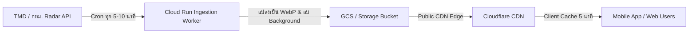

# Public User Static Radar Image Reference Architecture 🛰️

เอกสารนี้รวบรวมแนวทางและสถาปัตยกรรมการเปิดให้ **ผู้ใช้ทั่วไป (End Users)** สามารถดูภาพอ้างอิงเรดาร์จริง (Static Radar Images จาก TMD / กทม.) แบบเดียวกับมุมมองของผู้ดูแลระบบ (Admin) เพื่อใช้ยืนยันความถูกต้องและสร้างความมั่นใจ (User Trust & Transparency)

---

## 🎯 ปัญหาและแรงจูงใจ (Motivation & Problem Statement)

1. **User Trust (ความเชื่อมั่น):** ข้อมูลการพยากรณ์แบบ Vector/Polygon บนแอปเกิดจากการประมวลผลอัลกอริทึม (Optical Flow / Nowcasting) เมื่อผู้ใช้เกิดความสงสัย การได้เห็นภาพเรดาร์ดิบต้นฉบับจะช่วยยืนยันความแม่นยำได้ดีที่สุด
2. **Cross-checking (การตรวจสอบย้อนกลับ):** ผู้ใช้สายจริงจัง (เช่น ไรเดอร์, นักวิ่ง, คนเดินทาง) ต้องการดูทิศทางลมและการเคลื่อนที่ของกลุ่มเมฆจากภาพเรดาร์จริงประกอบการตัดสินใจ

---

## 🎨 1. แนวทางการออกแบบ UX/UI

### รูปแบบที่ 1: แผนที่เลเยอร์ซ้อนทับ (Layer Toggle & Ground Overlay) — *แนะนำที่สุด*
- **Interaction:** มีไอคอนชั้นเลเยอร์ (`Layers`) ที่มุมขวาบนของแผนที่
- **ตัวเลือก:**
  - `Interactive Map`: โหมดแผนที่ Vector ปกติ
  - `Official Radar Overlay`: ทาบภาพเรดาร์ต้นฉบับลงบนพิกัดแผนที่ (Georeferenced)
- **Controls:** มี **Opacity Slider (0–100%)** ให้ผู้ใช้ปรับความโปร่งใสของภาพเรดาร์ เพื่อให้มองเห็นถนน/สถานที่สำคัญด้านล่างควบคู่กันได้

### รูปแบบที่ 2: ปุ่มตรวจสอบเรดาร์ต้นฉบับ (View Source Image Modal)
- **Interaction:** ในการ์ดเตือนฝนตก (Bottom Sheet) มีปุ่มเล็กๆ เช่น *"📷 ดูภาพเรดาร์ทางการ"*
- **Display:** เปิดเป็น Modal หรือ Bottom Sheet แบบขยายเต็มจอ แสดงภาพ Static Image พร้อมบอก:
  - สถานีเรดาร์ (เช่น สถานีหนองจอก / ดอนเมือง)
  - วันเวลาของข้อมูล (Data Freshness Timestamp เช่น *14:15 น.*)

### รูปแบบที่ 3: หน้าต่างย่อย (Picture-in-Picture / Split Screen)
- เหมาะสำหรับจอแท็บเล็ตหรือมุมมอง Desktop หรือโหมด Pro User
- แสดงแผนที่ Interactive คู่กับภาพ Static Radar แบบเคียงข้างกัน

---

## ⚙️ 2. สถาปัตยกรรมเชิงเทคนิค (Frontend & Map Engine)

การนำภาพเรดาร์ Static (2D Image) มาทาบลงบนแผนที่แบบ Interactive Map (MapLibre / Mapbox / Leaflet) มีข้อกำหนดทางเทคนิคดังนี้:

1. **Georeferencing (การผูกพิกัด):**
   - ภาพเรดาร์แต่ละสถานีมีขอบเขตพิกัดละติจูด-ลองจิจูดที่แน่นอน (Bounding Box: `[West, South, East, North]`)
   - ใช้ความสามารถของ Map Engine เช่น `coordinates` ใน Image Source ของ MapLibre:
     ```json
     {
       "type": "image",
       "url": "https://cdn.fonmayang.com/radar/latest_bkk.webp",
       "coordinates": [
         [100.0, 14.5],
         [101.0, 14.5],
         [101.0, 13.0],
         [100.0, 13.0]
       ]
     }
     ```
2. **Color Filtering & Transparency:**
   - ขอบเขตพื้นหลังสีดำของภาพเรดาร์ดิบควรถูก Mask/Filter ออก หรือแปลงภาพให้มี Transparent Background ก่อนส่งให้ Client

---

## 🚀 3. Backend, Caching & Bandwidth Optimization

เพื่อป้องกันไม่ให้ Traffic จากผู้ใช้ทั่วไปยิงตรงไปยังต้นทาง (TMD/กทม.) จนเซิร์ฟเวอร์ต้นทางล่ม หรือถูกบล็อก IP:



1. **Dedicated Worker Ingestion:**
   - Worker ดึงภาพเรดาร์รอบล่าสุดทุกๆ 5–10 นาที
   - ประมวลผลลบขอบดำ (Alpha Masking) และแปลงเป็นฟอร์แมต **WebP** เพื่อลดขนาดไฟล์ลง 60–70%
2. **CDN Caching (ลด Egress Cost):**
   - ผู้ใช้ทุกคนจะเรียกผ่าน CDN URL เดียวกัน (เช่น `.../radar/latest.webp`)
   - ตั้งค่า `Cache-Control: public, max-age=300` (แคช 5 นาที)
   - ไม่เปลือง CPU และ Bandwidth ของเซิร์ฟเวอร์หลัก
3. **Freshness Header:**
   - ส่ง Header หรือ Metadata JSON กำกับ: `{ "station": "nongchok", "timestamp": "2026-09-20T08:15:00Z" }`

---

## 📋 แผนการดำเนินการ (Implementation Checklist)

- [ ] **Backend Worker:** เพิ่ม Task บันทึกภาพเรดาร์ล่าสุดลง CDN/GCS ในฟอร์แมต WebP แบบ Transparent
- [ ] **Frontend Map:** เพิ่ม Image Layer Source ที่ผูกพิกัด Bounding Box บน MapLibre
- [ ] **UI Controls:** เพิ่มปุ่มสลับ Layer และตัวปรับ Opacity ใน `radar-mockups`
- [ ] **Documentation:** อัปเดตผังเชื่อมโยงใน `docs/README.md`
