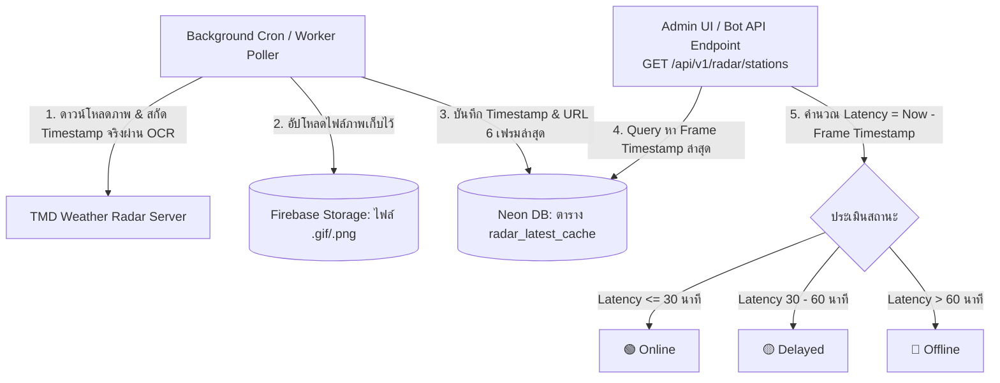

# TMD Radar Status Monitoring & Cache Architecture

เอกสารนี้อธิบายสถาปัตยกรรมและ Flow การประเมินสถานะ **Online / Offline / Delayed** ของสถานีเรดาร์ฝนหลวง TMD ทั้งหมดในระบบ FonMaYang

---

## 1. System Flow & Architecture Diagram

ระบบไม่ได้ยิง Request ตรวจสอบสถานะไปยัง TMD สดๆ ทุกครั้งที่มีผู้ใช้งานเปิดหน้าเว็บหรือเรียกใช้งานบอท เพื่อป้องกันปัญหา Network Timeout และ Rate Limit โดยใช้ระบบแคช 2 ชั้น (Firebase Storage สำหรับรูปภาพ และ Neon DB สำหรับ Timestamps):

---

## 2. Component Responsibilities

1. **TMD Weather Radar Server (ต้นทาง):**
   - ให้บริการภาพนิ่ง (`...latest.jpg / .png / .gif`) และภาพเคลื่อนไหววนซ้ำ (`...Loop.php / loop.gif`)
   - Background Poller จะเป็นตัวเดียวที่วิ่งไปดึงข้อมูลมาประมวลผลเป็นระยะ

2. **Firebase Storage (ที่เก็บไฟล์ภาพ):**
   - จัดเก็บไฟล์ Binary รูปภาพ/GIF จริง (เช่น `radar/<code_name>/<timestamp>.gif`)
   - ไม่เกี่ยวข้องกับการคำนวณสถานะ แต่ทำหน้าที่เก็บสื่อสำหรับส่งให้ Telegram / LINE หรือแสดงผลบนหน้าเว็บ

3. **Neon PostgreSQL Database (`radar_latest_cache`):**
   - จัดเก็บ Metadata ของแคช ได้แก่ `station_code`, `created_at`, `frames_json` (6 เฟรมล่าสุดพร้อม timestamp), และ `last_gif_fallback_time`
   - เป็นหัวใจหลักในการตัดสินสถานะ: เมื่อเรียก `/api/v1/radar/stations` ระบบจะนำ `frames[0]["timestamp"]` ลบออกจากเวลาปัจจุบัน (`now`) เพื่อประเมินสถานะ Latency แบบ Real-time ทันที
