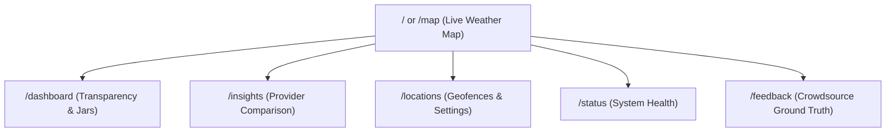

# Web Application Site Map & Page Architecture

This document provides a comprehensive overview of the **FonMaYang Web Application** pages, client interfaces, target personas, and associated GitLab issues.

---

## 🗺️ Page Structure & Sitemap

---

## 📄 Detailed Page Specifications

### 1. 🗺️ Live Weather & Radar Map (`/` or `/map`)
* **Issues:** #36, #46, #187, #188
* **Target Audience:** All End Users, General Public
* **Features:**
  * Interactive radar image overlays with Leaflet.js / Mapbox.
  * Rain vector direction & warning boundary visualization (#187).
  * Hover preview of storm cluster trajectories (#188).

### 2. 💚 Transparency & Gamification Dashboard (`/dashboard`)
* **Issues:** #191, #193, #198
* **Target Audience:** Donators, Supporters, BA/PO
* **Features:**
  * **Magic Link Token Auth:** Handles `token` parameter and stores pseudonymous auth token in Local Storage (#193).
  * **Live Runway Countdown:** SSE / WebSocket stream displaying remaining server lifespan (#191).
  * **Milestone Progress & Badges:** Displays donation goal progress bars and anonymized supporter badges (#198).
  * **Donation Lock & Waiting List:** Emergency kill-switch to mask leaderboards and divert traffic (#198).

### 3. 📊 Weather Insights & Provider Comparison (`/insights` or `/compare`)
* **Issues:** #42, #49, #53
* **Target Audience:** Weather Enthusiasts, Power Users
* **Features:**
  * Side-by-side weather model comparison (TMD, RainViewer, Rainbow, Xweather, Open-Meteo).
  * dBZ reflectivity and accuracy metric charts.

### 4. 📍 Location & Preference Settings (`/locations` or `/settings`)
* **Issues:** #9, #136, #145
* **Target Audience:** Registered / Bot-Linked Users
* **Features:**
  * Personal geofence management (Home, Work, Custom locations).
  * Dynamic Language Switcher (Thai / English) (#136).

### 5. ⚡ System Status & Infrastructure Health (`/status`)
* **Issues:** #79, #117, #118
* **Target Audience:** Developers, DevOps, Public Transparency
* **Features:**
  * Real-time server uptime metrics (BetterStack / UptimeRobot integration).
  * Cloud Tasks queue health & radar polling frequency log.

### 6. 🤝 Crowdsource Feedback (`/feedback` or `/crowdsource`)
* **Issues:** #39
* **Target Audience:** Community Contributors
* **Features:**
  * Ground truth rain confirmation reports used for ML radar auto-calibration.

---

## 📱 Client Access Interfaces

1. **Standalone Web Application:** Accessible via browser on desktop and mobile web.
2. **Telegram Mini App / LINE Rich Menu:** Embedded webview access directly inside Telegram and LINE bot interfaces.
