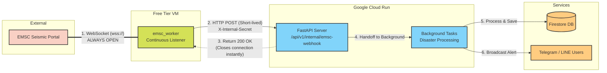

# EMSC WebSocket Worker

This is a lightweight standalone worker designed to run on a Google Compute Engine e2-micro VM (Free Tier). 
It connects to the EMSC earthquake WebSocket and forwards events to the main Cloud Run API via an internal webhook.

This decouples the persistent WebSocket connection from the Cloud Run instances, preventing memory leaks and allowing Cloud Run to scale to zero (Issue #89).

## Deployment Instructions (Ubuntu VM)

1. **Provision an e2-micro VM** in Google Cloud Console.
2. **SSH into the VM** and install python/pip:
   ```bash
   sudo apt update
   sudo apt install python3 python3-pip python3-venv -y
   ```
3. **Upload this folder** (`emsc_worker/`) to the VM (e.g., `/home/ubuntu/emsc_worker`).
4. **Create a virtual environment** and install dependencies:
   ```bash
   cd /home/ubuntu/emsc_worker
   python3 -m venv venv
   source venv/bin/activate
   pip install -r requirements.txt
   ```
5. **Create the Environment File (`.env`)**:
   - Copy the example file and edit it to include your actual Cloud Run URL and the secret:
     ```bash
     cp .env.example .env
     nano .env
     ```
6. **Configure the Systemd Service**:
   - Copy the service file to systemd:
     ```bash
     sudo cp emsc_worker.service /etc/systemd/system/
     sudo systemctl daemon-reload
     sudo systemctl enable emsc_worker.service
     sudo systemctl start emsc_worker.service
     ```
7. **Check Logs**:
   ```bash
   sudo journalctl -u emsc_worker -f
   ```

## Architecture


